# Omnichannel Retail Management System (ORCLMS) — Master Interview Guide

> **One document to understand the entire project A‑to‑Z** for an internal, code‑focused
> interview. It explains *what* every piece is, *how* it works (down to the line), *why* it
> was chosen, and *what breaks if you remove it*. Deep dives on **auth‑service**,
> **api‑gateway**, **config‑server**, **order‑service**, plus **all** other modules.
>
> Diagrams are **Mermaid** — they render in IntelliJ's Markdown preview and on GitHub.
> A separate **`CHEAT_SHEET.md`** has the night‑before rapid‑revision material.

---

## Table of Contents
1. [Elevator Pitch](#1-elevator-pitch)
2. [The Big Picture — Architecture](#2-the-big-picture--architecture)
3. [Technology Stack (and why each was chosen)](#3-technology-stack-and-why-each-was-chosen)
4. [Ports, URLs & Routing Map](#4-ports-urls--routing-map)
5. [Core Spring Cloud Concepts (plain English)](#5-core-spring-cloud-concepts-plain-english)
6. [Infrastructure Services — Deep Dive](#6-infrastructure-services--deep-dive)
7. [auth-service — The Full Deep Dive (your weak area)](#7-auth-service--the-full-deep-dive)
8. [JWT From Zero to Expert](#8-jwt-from-zero-to-expert)
9. [The Two JWT Filters — Why Both Exist](#9-the-two-jwt-filters--why-both-exist)
10. [Business Services — Deep Dive (all modules)](#10-business-services--deep-dive-all-modules)
11. [The Frontend (vanilla JS SPA)](#11-the-frontend-vanilla-js-spa)
12. [Keystroke‑Level Flows (button click → DB)](#12-keystroke-level-flows-button-click--db)
13. [Resilience: Circuit Breakers & Fallbacks](#13-resilience-circuit-breakers--fallbacks)
14. [Transactions & Data Consistency](#14-transactions--data-consistency)
15. [Spring Security Filter Chain](#15-spring-security-filter-chain)
16. [Spring Cloud Gateway / WebFlux (reactive) explained](#16-spring-cloud-gateway--webflux-reactive-explained)
17. [Use Case Diagrams (every action, per role)](#17-use-case-diagrams)
18. [Data Model (per service)](#18-data-model-per-service)
19. ["What if we remove X?" — Master Table](#19-what-if-we-remove-x--master-table)
20. [Code‑Specific Gotcha Questions (with answers)](#20-code-specific-gotcha-questions-with-answers)
21. [How to Run the Whole System](#21-how-to-run-the-whole-system)
22. [Glossary](#22-glossary)

---

## 1. Elevator Pitch

> "ORCLMS is a **microservices‑based retail platform** built with **Spring Boot** and
> **Spring Cloud**. Retail staff manage products, orders, returns, promotions, and customer
> loyalty across multiple sales channels (web, store, etc.). Each domain is an **independent
> service that owns its own MySQL database** and talks to others over REST. A **Config Server**
> centralizes configuration, **Eureka** handles service discovery, and an **API Gateway** is
> the single secured entry point that validates **JWT tokens** issued by a dedicated
> **auth‑service**. The frontend is a lightweight vanilla‑JS app that only ever talks to the
> gateway."

**Role‑based one‑liner:** staff roles (Admin, Store Manager, Merchandiser, Customer Service,
Marketing Manager) log in once, receive a JWT, and the gateway uses that token to authorize
every subsequent request to the right microservice.

---

## 2. The Big Picture — Architecture

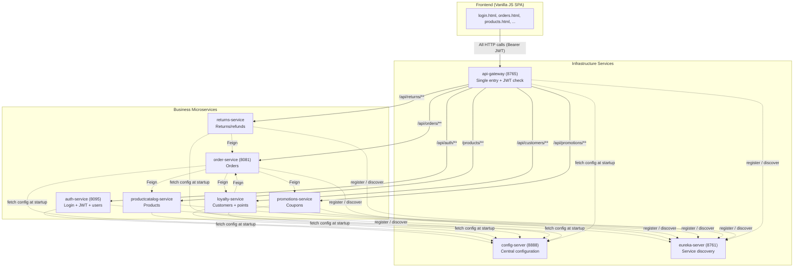
```mermaid
flowchart TB
    subgraph Client["Frontend (Vanilla JS SPA)"]
        UI["login.html, orders.html, products.html, ..."]
    end

    subgraph Infra["Infrastructure Services"]
        CONFIG["config-server (8888)\nCentral configuration"]
        EUREKA["eureka-server (8761)\nService discovery"]
        GATEWAY["api-gateway (8765)\nSingle entry + JWT check"]
    end

    subgraph Business["Business Microservices"]
        AUTH["auth-service (8095)\nLogin + JWT + users"]
        ORDER["order-service (8081)\nOrders"]
        PRODUCT["productcatalog-service\nProducts"]
        LOYALTY["loyalty-service\nCustomers + points"]
        PROMO["promotions-service\nCoupons"]
        RETURNS["returns-service\nReturns/refunds"]
    end

    UI -->|"All HTTP calls (Bearer JWT)"| GATEWAY

    GATEWAY -->|/api/auth/**| AUTH
    GATEWAY -->|/api/orders/**| ORDER
    GATEWAY -->|/products/**| PRODUCT
    GATEWAY -->|/api/customers/**| LOYALTY
    GATEWAY -->|/api/promotions/**| PROMO
    GATEWAY -->|/api/returns/**| RETURNS

    ORDER -.Feign.-> PRODUCT
    ORDER -.Feign.-> LOYALTY
    ORDER -.Feign.-> PROMO
    LOYALTY -.Feign.-> ORDER
    RETURNS -.Feign.-> ORDER

    AUTH & ORDER & PRODUCT & LOYALTY & PROMO & RETURNS & GATEWAY -. "register / discover" .-> EUREKA
    AUTH & ORDER & PRODUCT & LOYALTY & PROMO & RETURNS & GATEWAY -. "fetch config at startup" .-> CONFIG
```

**Reading it:**
- The **frontend never calls a service directly** — everything goes through the **API Gateway** at `http://localhost:8765`.
- **Solid arrows** = synchronous HTTP routing through the gateway.
- **Dotted arrows** = internal service‑to‑service calls (**OpenFeign**) and infra wiring (Eureka registration, Config fetch).
- Note the **bidirectional** order↔loyalty and returns→order Feign links (loyalty enriches a customer with their order history; returns verify the order before accepting a return).

---

## 3. Technology Stack (and why each was chosen)

| Layer | Technology | Why it's used | What if removed |
|---|---|---|---|
| Language / Runtime | **Java + Spring Boot** | Fast microservice development, huge ecosystem | No app |
| Service discovery | **Spring Cloud Netflix Eureka** | Services find each other by *name*, not hard‑coded IPs | Gateway/Feign can't resolve `lb://service-name`; calls fail |
| Central config | **Spring Cloud Config Server** | One place for all `.properties`; shared JWT secret | Each service has no config → won't start (no port/DB/JWT) |
| API Gateway | **Spring Cloud Gateway (WebFlux/reactive)** | Single entry, routing, central JWT check, CORS | No single entry, no central auth; frontend must call every service & each must re‑implement auth |
| Inter‑service calls | **OpenFeign** | Declarative REST clients (write an interface, get an HTTP client) | You'd hand‑write `RestTemplate`/`WebClient` calls |
| Resilience | **Resilience4j Circuit Breaker** | Graceful degradation when a downstream is down | One slow/dead dependency can cascade and freeze callers |
| Security | **Spring Security + JWT (jjwt) + BCrypt** | Stateless auth; salted password hashing | No authentication/authorization; plaintext passwords |
| Persistence | **Spring Data JPA + MySQL** | Each service owns its DB (`order_db`, `authservice_db`, …) | No storage |
| Frontend | **Vanilla HTML/CSS/JS (ES modules)** | Lightweight; talks only to the gateway | No UI |

---

## 4. Ports, URLs & Routing Map

| Service | Port | Gateway path predicate | Internal base path |
|---|---|---|---|
| config-server | 8888 | — (infra) | — |
| eureka-server | 8761 | — (infra) | — |
| api-gateway | **8765** | the front door | — |
| auth-service | 8095 | `/api/auth/**` | `/api/auth` |
| order-service | 8081 | `/api/orders/**` | `/api/orders` |
| productcatalog-service | (Eureka) | `/products/**` | `/products` |
| loyalty-service | (Eureka) | `/api/customers/**` | `/api/customers` |
| promotions-service | (Eureka) | `/api/promotions/**` | `/api/promotions` |
| returns-service | (Eureka) | `/api/returns/**` | `/api/returns` |

> Routes are defined in `orclms-config-server-main/api-gateway.properties` using
> `uri=lb://<service-name>` (load‑balanced via Eureka). The frontend's gateway address lives in
> `frontend/assets/js/config.js` (`BASE_URL: "http://localhost:8765"`).

⚠️ **Gotcha:** productcatalog is exposed at `/products/**` (NOT `/api/...`). All others use the
`/api/...` convention. Easy to trip on in an interview.

---

## 5. Core Spring Cloud Concepts (plain English)

| Concept | One‑sentence explanation | Where it lives here |
|---|---|---|
| **Service Discovery** | Services register & find each other by name, not IP. | Eureka server + clients |
| **Centralized Config** | All config in one server, fetched at startup. | config-server + `orclms-config-server-main/` |
| **API Gateway** | One secured entry point that routes to services. | api-gateway + `api-gateway.properties` |
| **Client‑side Load Balancing** | `lb://service-name` picks a live instance from Eureka. | gateway routes & Feign |
| **Declarative REST client** | An `@FeignClient` interface becomes an HTTP client. | each service's `client/`/`feign/` package |
| **Circuit Breaker** | Stop calling a failing dependency; use a fallback. | Resilience4j + `*Fallback` classes |
| **Stateless JWT auth** | No server session; identity travels inside a signed token. | auth-service signs, gateway verifies |

**Analogy for the infra trio:**
- **Eureka = a phone directory** — look up a service by name to get its current address.
- **Config Server = a shared settings binder** — everyone reads their page on startup.
- **API Gateway = the building's security desk** — one entrance, checks your badge (JWT), points you to the right room.

---

## 6. Infrastructure Services — Deep Dive

### 6.1 config-server
- **What:** A Spring Cloud **Config Server** (`@EnableConfigServer`, port 8888). On startup every
  other service asks it *"give me my configuration."*
- **Where config lives:** the `orclms-config-server-main/` folder — one `.properties` per
  service + a shared `application.properties`.
- **The shared `application.properties` holds settings for everyone:**
  ```ini
  eureka.client.service-url.defaultZone=http://localhost:8761/eureka
  spring.jpa.hibernate.ddl-auto=update
  spring.jpa.show-sql=true
  jwt.secret=...           # shared HS256 secret (>= 32 chars)
  jwt.expiration=3600000   # 1 hour in ms
  ```
- **Why it exists:** change settings without rebuilding services; keep the **JWT secret in
  exactly one place** so auth‑service (signs) and api‑gateway (verifies) always agree.

> **🟥 What if removed?** Services that rely on it for their port, datasource, and JWT secret
> would fail to start (or start mis‑configured). auth‑service couldn't read `jwt.secret`; the
> gateway couldn't verify tokens. **This is a startup‑time dependency**, which is why
> config‑server boots first.

### 6.2 eureka-server
- **What:** The **service registry** (`@EnableEurekaServer`, port 8761). Each service registers
  by name (`order-service`, `loyalty-service`, …) and discovers others by name.
- **Why it exists:** lets the gateway route to `lb://order-service` and Feign call
  `@FeignClient(name = "loyalty-service")` — **no IP addresses anywhere**. `lb://` = *load
  balanced*: with multiple instances, requests spread across them.

> **🟥 What if removed?** `lb://` lookups and Feign name resolution fail. The gateway returns
> errors, inter‑service calls break (and trip circuit breakers). The system effectively can't
> route.

### 6.3 api-gateway
- **What:** The single front door (port 8765, **reactive WebFlux**). The frontend's `BASE_URL`
  points here. Plain `@SpringBootApplication` (discovery client auto‑configured).
- **Two jobs:**
  1. **Routing** (from `api-gateway.properties`) — maps URL paths to `lb://service` (see §4).
  2. **Central JWT validation** — a `GlobalFilter` (`JwtAuthenticationGatewayFilter`) checks the
     `Authorization: Bearer <token>` header on **every** request except public ones.
- **The gateway filter (`JwtAuthenticationGatewayFilter`) in detail:**
  - `getOrder()` returns **‑1** → runs **early, before routing**.
  - Lets **CORS preflight** (`OPTIONS`) through (no Authorization header on preflight).
  - **PUBLIC_PATHS** = `/api/auth/login`, `/actuator`, `/eureka` → skipped (uses `path::startsWith`).
  - Otherwise requires `Bearer <token>`; if missing → **401**.
  - Parses the token with `JwtUtil.parseClaims` (verifies signature + expiry using the shared
    secret), then **mutates the request** to add trusted headers:
    `X-Auth-User = subject`, `X-Auth-Role = role` claim. Downstream services can *trust* these.
  - On any parse/verify exception → **401** "Invalid or expired token".
- **CORS** is configured separately in `CorsConfig` (a `CorsWebFilter`): allows all origins
  (pattern `*`), methods GET/POST/PUT/PATCH/DELETE/OPTIONS, all headers, `allowCredentials=false`,
  `maxAge=3600`.

> **🟥 What if removed?** No single entry point and **no central authentication**. The frontend
> would have to call each service directly (and handle CORS for each), and *every* service would
> need to re‑implement JWT validation. Security would be scattered and inconsistent.

⚠️ **Gotcha:** the gateway sets a **401 status but discards the message** (`unauthorized()`
ignores the `message` arg and just calls `setComplete()`). So the browser sees `401` with an
empty body — `api.js` then shows a generic "session expired" message.

---

## 7. auth-service — The Full Deep Dive

> This is the part you said you're weak on, so it's the most detailed section. auth‑service owns
> **users, login, and JWT issuing**. DB: `authservice_db`. Port 8095.

### 7.1 Class‑by‑class map

| Class | Role |
|---|---|
| `AuthController` | REST endpoints under `/api/auth` |
| `AuthService` | Business logic: login, createUser, getAllUsers |
| `JwtService` | **Signs** & parses JWTs (the issuer side) |
| `JwtAuthenticationFilter` | Per‑request filter that reads a Bearer token and sets the Spring Security context |
| `CustomUserDetailsService` | Loads a `User` from DB for Spring Security |
| `SecurityConfig` | The Spring Security filter chain + beans (`PasswordEncoder`, `AuthenticationManager`) |
| `DataInitializer` | Seeds the first ADMIN at startup |
| `User` / `Role` | JPA entity + role enum |
| `UserRepository` | Spring Data JPA repo (`findByUsername`, `existsByUsername`) |
| DTOs | `LoginRequest`, `AuthResponse`, `CreateUserRequest`, `UserResponse` |

### 7.2 Endpoints (`/api/auth`)
| Method | Path | Access | Purpose |
|---|---|---|---|
| `POST` | `/login` | **public** | Verify credentials, return a JWT |
| `POST` | `/users` | **ADMIN only** | Provision a new staff account |
| `GET` | `/users` | **ADMIN only** | List accounts |

There is **no self‑registration** — only an ADMIN creates accounts.

### 7.3 Login logic (`AuthService.login`) — line by line
```java
public AuthResponse login(LoginRequest request) {
    // 1) Ask Spring Security to verify username+password.
    //    Internally: CustomUserDetailsService loads the user, BCrypt checks the password.
    //    Throws AuthenticationException if bad credentials / disabled.
    authenticationManager.authenticate(
        new UsernamePasswordAuthenticationToken(request.getUsername(), request.getPassword()));

    // 2) Load the full user (we need the role for the token).
    User user = userRepository.findByUsername(request.getUsername())
        .orElseThrow(() -> new IllegalArgumentException("User not found"));

    // 3) Sign a JWT carrying username (subject) + role (claim).
    String token = jwtService.generateToken(user.getUsername(), user.getRole().name());

    // 4) Return token + identity + how long it's valid.
    return new AuthResponse(token, user.getUsername(), user.getRole().name(),
                            jwtService.getExpirationMs());
}
```
**Key idea:** `AuthenticationManager` is the *gatekeeper*; `JwtService` is the *ticket printer*.
They are separate responsibilities.

### 7.4 `JwtService` (the issuer side) — how a token is signed
```java
public JwtService(@Value("${jwt.secret}") String secret,
                  @Value("${jwt.expiration:3600000}") long expirationMs) {
    this.signingKey = Keys.hmacShaKeyFor(secret.getBytes(UTF_8)); // HS256 key from shared secret
    this.expirationMs = expirationMs;
}

public String generateToken(String username, String role) {
    Date now = new Date();
    return Jwts.builder()
        .subject(username)          // "sub" claim  = who you are
        .claim("role", role)        // custom claim = what you can do
        .issuedAt(now)              // "iat"
        .expiration(new Date(now.getTime() + expirationMs)) // "exp" (1 hour later)
        .signWith(signingKey)       // HMAC-SHA256 signature using the shared secret
        .compact();                 // -> header.payload.signature string
}
```
- `extractUsername` / `extractRole` parse claims; `parseSignedClaims` **verifies the signature**
  and throws if the token was tampered with or signed with a different secret.
- `isTokenValid(token)` = "not expired and signature verifies"; `getExpirationMs()` is returned to
  the frontend so the UI knows the lifetime.

### 7.5 `CustomUserDetailsService` — how Spring loads a user
Implements `UserDetailsService.loadUserByUsername`. It fetches the `User` from the DB and builds a
Spring Security `UserDetails` with:
- `username`, `password` (the **BCrypt hash**),
- `disabled(!enabled)`,
- one authority `ROLE_<role>` (e.g. `ROLE_ADMIN`).

The `AuthenticationManager` uses this + the `PasswordEncoder` (BCrypt) to verify the password.

### 7.6 `SecurityConfig` — the rules
```java
http
  .csrf(csrf -> csrf.disable())                      // stateless API, no browser form CSRF
  .authorizeHttpRequests(auth -> auth
      .requestMatchers("/api/auth/login").permitAll()
      .requestMatchers("/actuator/**").permitAll()
      // Only ADMIN can manage users; match exact + sub-paths
      .requestMatchers("/api/auth/users", "/api/auth/users/**").hasRole("ADMIN")
      .anyRequest().authenticated())
  .sessionManagement(sm -> sm.sessionCreationPolicy(STATELESS)) // no HttpSession
  .addFilterBefore(jwtAuthenticationFilter, UsernamePasswordAuthenticationFilter.class);
```
- `PasswordEncoder` bean = `BCryptPasswordEncoder`.
- `AuthenticationManager` bean is taken from `AuthenticationConfiguration`.
- **`hasRole("ADMIN")`** matches the authority **`ROLE_ADMIN`** (Spring adds the `ROLE_` prefix
  automatically — that's why the filter/userdetails use `ROLE_` explicitly).

### 7.7 `DataInitializer` — the first admin
A `CommandLineRunner` that runs on startup: if the admin username doesn't exist, it creates
`admin` / `admin123` (BCrypt‑hashed) with role `ADMIN` and logs a "change the password" note.
Username/password come from `auth-service.properties` (`auth.admin.username/password`).

### 7.8 Why auth‑service has its *own* security filter (not just the gateway)
auth‑service is itself a Spring Security app because **`/api/auth/users` must be ADMIN‑only**.
Even a valid non‑admin JWT must be rejected there. So auth‑service re‑reads the token to populate
the security context and enforce `hasRole("ADMIN")`. (More on the dual‑filter design in §9.)

> **🟥 What if removed?** No login, no tokens, no users. The gateway would have nothing to verify
> against and the whole system is unreachable (login is the only way in).

---

## 8. JWT From Zero to Expert

**JWT = JSON Web Token**: a signed, self‑contained string carrying identity/claims. It has three
Base64URL parts joined by dots: **`header.payload.signature`**.

```
eyJhbGciOiJIUzI1NiJ9 . eyJzdWIiOiJhZG1pbiIsInJvbGUiOiJBRE1JTiIsImlhdCI6... . 3Q2hF...signature
        header                         payload (claims)                            signature
```

1. **Header** — algorithm & type, e.g. `{"alg":"HS256","typ":"JWT"}`.
2. **Payload (claims)** — in this project: `sub` (username), `role`, `iat` (issued at),
   `exp` (expiry). **Not encrypted** — anyone can Base64‑decode and read it. Never put secrets in it.
3. **Signature** — `HMACSHA256(base64(header) + "." + base64(payload), secret)`. Proves the token
   wasn't altered and was issued by someone holding the secret.

**HS256 (symmetric):** the **same secret** both **signs** (auth‑service) and **verifies**
(gateway). That's why the secret lives once in config‑server's `application.properties` and both
read it via `@Value("${jwt.secret}")`. If the secrets differ, verification fails → 401.

**Why stateless matters:** the server keeps **no session**. Identity is *in the token*. Any
instance of the gateway/service can validate it independently → easy horizontal scaling.

**Expiry:** `jwt.expiration=3600000` ms = **1 hour**. After that, verification fails and the user
must log in again.

**BCrypt (separate from JWT):** passwords are hashed with **BCrypt** (slow + salted) before
storage. Login compares the entered password against the stored hash. JWT secures the *session*;
BCrypt secures the *stored password*.

**Common JWT interview answers (memorize):**
- *Can a user tamper with their role claim?* No — changing the payload invalidates the signature
  (they don't have the secret).
- *Is the payload secret?* No — it's just Base64; it's signed, not encrypted.
- *How do you revoke a JWT before expiry?* Hard with pure stateless JWT — you'd need a blocklist
  or short expiry + refresh tokens. This project uses **short expiry (1h)**.
- *Where is it stored on the client?* `localStorage` (`auriaToken`) in `auth.js`.

---

## 9. The Two JWT Filters — Why Both Exist

This project has **two** JWT filters. Interviewers love this. Know the difference cold.

| | **`JwtAuthenticationGatewayFilter`** (api‑gateway) | **`JwtAuthenticationFilter`** (auth‑service) |
|---|---|---|
| Type | Spring Cloud Gateway `GlobalFilter` (reactive) | Servlet `OncePerRequestFilter` (blocking) |
| Runs in | api‑gateway (WebFlux) | auth‑service (MVC) |
| Job | **Gatekeeping at the edge** — reject anonymous/expired requests; inject `X-Auth-User`/`X-Auth-Role` | **Populate the SecurityContext** so `hasRole("ADMIN")` works for `/api/auth/users` |
| On invalid token | Returns **401** immediately | Clears context, lets request continue → Spring rules then reject |
| Forwards identity? | Yes (adds headers) | No (uses local SecurityContext) |

**Why both?**
- The **gateway** answers *"is this caller authenticated at all?"* for the whole system, so each
  business service doesn't re‑implement auth.
- **auth‑service** still needs the token *inside* itself to enforce **role‑based** access on
  `/api/auth/users` (ADMIN‑only). The gateway only checks *validity*, not *which role can hit
  which auth endpoint*.

> Note: the *other* business services (order, product, loyalty, etc.) **do not** validate JWTs
> themselves — they trust the gateway. Only auth‑service has its own Spring Security chain because
> it has an endpoint that must be ADMIN‑restricted.

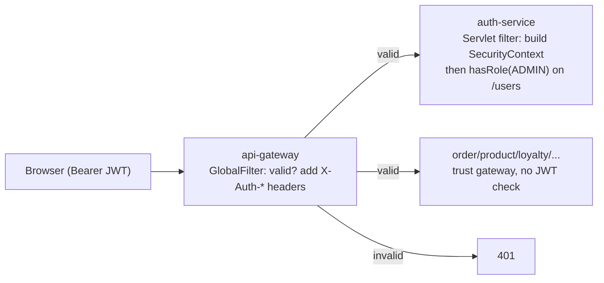
```mermaid
flowchart LR
    B["Browser (Bearer JWT)"] --> GW["api-gateway\nGlobalFilter: valid? add X-Auth-* headers"]
    GW -->|valid| AUTH["auth-service\nServlet filter: build SecurityContext\nthen hasRole(ADMIN) on /users"]
    GW -->|valid| OTHERS["order/product/loyalty/...\ntrust gateway, no JWT check"]
    GW -->|invalid| X["401"]
```

---

## 10. Business Services — Deep Dive (all modules)

### 10.1 order-service
- **Port 8081, DB `order_db`.** `@EnableFeignClients`. The **showcase of inter‑service comms +
  resilience**.
- **Endpoints (`/api/orders`):**
  | Method | Path | Purpose |
  |---|---|---|
  | GET | `/api/orders` (`?customerId=`) | all orders, or one customer's history |
  | GET | `/api/orders/{id}` | one order |
  | GET | `/api/orders/products` | product list (proxied from catalog) |
  | POST | `/api/orders` | place an order |
  | POST | `/api/orders/{id}/cancel` | cancel |
  | PATCH | `/api/orders/{id}/status` | change status |
  | GET | `/api/orders/{id}/allowed-statuses` | valid next statuses (drives UI dropdown) |
- **Feign clients:**
  - `ProductClient` → `productcatalog-service` (`/products`): `getAllProducts`, `getProduct(id)`. Fallback returns empty list / null.
  - `CustomerClient` → `loyalty-service` (`/api/customers`): `getCustomer(id)`, `addLoyaltyPoints(id, amount)` (POST `/{id}/accrue`). Fallback for resilience.
  - `PromotionClient` → `promotions-service` (`/api/promotions`): `applyCoupon(code, amount)` (POST `/apply`). Fallback returns null.
- **`placeOrder` (`@Transactional`) logic:**
  1. Validate request (customerId, channel, ≥1 item).
  2. **Feign → loyalty**: confirm customer exists.
  3. For each item, **Feign → catalog**: product exists, is **active**, valid price; compute line total.
  4. Sum → `totalAmount`; status **PLACED**; date today.
  5. **Coupon (best‑effort)**: `applyCouponIfPresent` calls promotions‑`apply`. The coupon is only
     stored (and total lowered) if the returned `finalAmount` **genuinely reduced** the total.
     If promotions is down / coupon invalid → caught, order proceeds at full price.
  6. `processPayment(total > 0)` — a stand‑in for a real gateway.
  7. Save order + items.
- **Order status state machine** (`isValidTransition`):
  ```mermaid
  stateDiagram-v2
      [*] --> PLACED
      PLACED --> CONFIRMED
      PLACED --> CANCELLED
      CONFIRMED --> SHIPPED
      CONFIRMED --> CANCELLED
      SHIPPED --> DELIVERED
      DELIVERED --> [*]
      CANCELLED --> [*]
  ```
  Transitions are enforced — you can't skip steps or go backward. On reaching **DELIVERED**,
  order‑service **Feign → loyalty** to **accrue points** (`notifyLoyaltyOnDelivery`).

> **🟥 What if removed?** No order lifecycle — the core retail flow is gone. Returns‑service (which
> verifies orders) and loyalty accrual on delivery would also break.

### 10.2 productcatalog-service
- **Exposed at `/products` (not `/api`).** DB‑backed product catalog. Used by Merchandisers.
- **Entity `Product`:** `productId`, `skuCode` (unique), `productName`, `category`, `basePrice`,
  `productStatus` (`ACTIVE` / `INACTIVE` / `DISCONTINUED`).
- **Endpoints (`/products`):**
  | Method | Path | Purpose |
  |---|---|---|
  | GET | `/products` | list all |
  | GET | `/products/{id}` | get one (404 if missing) |
  | POST | `/products` | add (rejects duplicate SKU) |
  | PUT | `/products/{id}/price?basePrice=` | update price (>0) |
  | PUT | `/products/{id}/deactivate` | set INACTIVE |
  | PUT | `/products/{id}/discontinue` | set DISCONTINUED |
- **Why it matters to orders:** order‑service reads price + `active` flag here at checkout, so it
  never trusts client‑sent prices.

> **🟥 What if removed?** order‑service's product validation falls back to empty/null → orders fail
> ("Product not found"). The catalog is a hard dependency for placing orders.

### 10.3 loyalty-service
- **Exposed at `/api/customers`.** Manages **customers**, **points**, and **tiers**. Calls
  order‑service (`OrderClient`) to enrich a customer with their order history.
- **Entity `Customer`:** `customerId`, `fullName`, `emailId` (unique), `phoneNumber`,
  `loyaltyPoints` (default 0), `loyaltyTier` (`SILVER`/`GOLD`/`PLATINUM`, default SILVER).
- **Tier rules (`updateLoyaltyTier`):** `>=2000` → PLATINUM, `>=1000` → GOLD, else SILVER.
- **Points:** `accruePointsFromPurchase(amount)` adds `floor(amount)` points (called by
  order‑service on delivery via the `/accrue` endpoint); `addPoints` (manual); `redeemPoints`
  (subtract, errors if insufficient). Each recomputes the tier.
- **Endpoints (`/api/customers`):**
  | Method | Path | Purpose |
  |---|---|---|
  | GET | `/` | list customers |
  | GET | `/{id}` | get one (+ order history via Feign; empty list if order‑service down) |
  | POST | `/` | register (rejects duplicate email) |
  | POST | `/{id}/redeem?points=` | redeem points |
  | POST | `/{id}/accrue?amount=` | accrue from a purchase (used by order‑service) |
  | POST | `/{id}/add-points?points=` | manually add points |

> **🟥 What if removed?** Placing an order fails (customer can't be verified), and delivered orders
> can't accrue points. Customer Service loses its workspace.

### 10.4 promotions-service
- **Exposed at `/api/promotions`.** Manages **coupons** and computes discounts. Also has
  *optional* Feign clients to order/product/loyalty/returns (injected with
  `@Autowired(required=false)` so it degrades gracefully if they're absent).
- **Entity `Coupon`:** `couponId`, `couponCode`, `discountType` (`PERCENTAGE` or flat),
  `discountValue`, `validFrom`, `validTo`, `couponStatus` (`ACTIVE`/`EXPIRED`/`REDEEMED`).
- **`validateCoupon(code)`:** not‑found → 404; before `validFrom` → not valid yet; after `validTo`
  → marks EXPIRED + throws; REDEEMED → "already used"; non‑ACTIVE → "not active".
- **`applyDiscount(code, amount)`:** PERCENTAGE → `amount - amount*value/100`; else flat
  `amount - value`; floors at 0. Returns `finalAmount`. **This is what order‑service calls.**
- **Key endpoints (`/api/promotions`):**
  | Method | Path | Purpose |
  |---|---|---|
  | GET | `/coupons` | list |
  | POST | `/coupons` | create (validates dates + value) |
  | PUT | `/coupons/{id}` | update |
  | DELETE | `/coupons/{id}` | delete |
  | GET | `/coupons/{code}/validate` | validate |
  | POST | `/apply?code=&amount=` | apply discount (no state change) |
  | POST | `/coupons/{code}/apply-once?amount=` | apply + mark REDEEMED (transactional) |
  | POST | `/coupons/{code}/redeem` | mark REDEEMED |

> **🟥 What if removed?** Coupons can't be applied — but order‑service handles this **gracefully**
> (best‑effort): orders just complete at full price. Marketing loses coupon management. This is the
> best example of *graceful degradation* in the system.

### 10.5 returns-service
- **Exposed at `/api/returns`.** Manages the **return/refund lifecycle**. Uses `OrderFeignClient`
  to verify the order before accepting a return.
- **Entity `ReturnRequest`:** `returnId`, `orderId`, `returnReason`, `refundAmount`, `requestDate`,
  `returnStatus` (`REQUESTED`/`APPROVED`/`REJECTED`/`REFUNDED`).
- **`initiateReturn` rules:**
  - Order must exist (Feign → order‑service; if order‑service down → "unable to verify").
  - Order must be **DELIVERED**.
  - No existing return for that order.
  - Within the **30‑day** return window from the order date.
  - Refund amount is set from the order's total. Status starts **REQUESTED**.
- **Lifecycle transitions:**
  ```mermaid
  stateDiagram-v2
      [*] --> REQUESTED
      REQUESTED --> APPROVED
      REQUESTED --> REJECTED
      APPROVED --> REFUNDED
      REJECTED --> [*]
      REFUNDED --> [*]
  ```
  Only `REQUESTED` can be approved/rejected; only `APPROVED` can be refunded.
- **Endpoints (`/api/returns`):** GET `/`, GET `/{id}`, POST `/`, POST `/{id}/approve`,
  POST `/{id}/reject`, POST `/{id}/refund`.

> **🟥 What if removed?** Customers can't return delivered orders / get refunds. Doesn't affect the
> ordering path. Returns depends on order‑service being up to validate.

---

## 11. The Frontend (vanilla JS SPA)

Plain HTML/JS, organized by module (`order-management/`, `productcatalog/`, `loyalty/`,
`promotion/`, `returns/`, `admin/`). **No framework** — just ES modules.

**Shared JS (`assets/js/`):**
- **`config.js`** — `BASE_URL` (the gateway) and currency. The one file to edit on deploy.
- **`api.js`** — the single `fetch` wrapper. Attaches `Authorization: Bearer <token>`, parses
  error bodies, and on **401 with a token present** clears the session + redirects to login.
  (It deliberately does **not** redirect on 401 when there was no token — so a failed login shows
  the real error.)
- **`endpoints.js`** — every backend URL named once (`AuthAPI`, `OrderAPI`, `ProductAPI`,
  `CustomerAPI`, `ReturnAPI`, `PromotionAPI`). Pages never hard‑code URLs.
- **`auth.js`** — stores token/username/role in `localStorage`; maps backend role → nav role;
  decides the **landing page per role** (`landingFor`); guards protected pages (`requireAuth`).
- `ui.js`, `layout.js` — toasts, form errors, sidebar.

**Role → landing page** (from `auth.js`):
| Backend role | Nav role | Lands on |
|---|---|---|
| ADMIN | admin | `admin/users.html` |
| MERCHANDISER | merchandiser | `productcatalog/products.html` |
| STORE_MANAGER | storemanager | `order-management/orders.html` |
| CUSTOMER_SERVICE | csa | `loyalty/customers.html` |
| MARKETING_MANAGER | marketing | `promotion/promotions.html` |

⚠️ **Security note:** the frontend role menus are **UX only**, *not* a security boundary. Real
enforcement is the gateway (is the token valid?) + auth‑service (`hasRole("ADMIN")`).

> **🟥 What if removed?** No UI, but the REST API still works (e.g., via Postman). The frontend is
> a thin client over the gateway.

---

## 12. Keystroke‑Level Flows (button click → DB)

### 12.1 Flow: Login
**Plain English:**
1. User types username + password on `login.html`, clicks **Sign in**.
2. `login.js` prevents default submit, validates both fields, disables the button, calls
   `AuthAPI.login({username, password})`.
3. `endpoints.js` → `POST /api/auth/login`; `api.js` sends it to the gateway
   (`http://localhost:8765/api/auth/login`). **No token yet — login is public.**
4. Gateway sees `/api/auth/login` is in **PUBLIC_PATHS** → skips JWT check → routes to
   `lb://auth-service`.
5. `AuthController.login()` → `AuthService.login()`:
   - `AuthenticationManager.authenticate(...)` → `CustomUserDetailsService` loads user → **BCrypt**
     verifies password.
   - On success, `JwtService.generateToken()` signs a JWT (username + role, 1h).
   - Returns `AuthResponse { token, username, role, expiresInMs }`.
6. Browser: `login.js` calls `setSession()` → stores token/username/role in `localStorage`, shows
   a welcome toast, redirects to the role's landing page (`landingFor()`).
7. From now on, **every** `api.js` call attaches `Authorization: Bearer <token>`, and the gateway
   validates it each time.

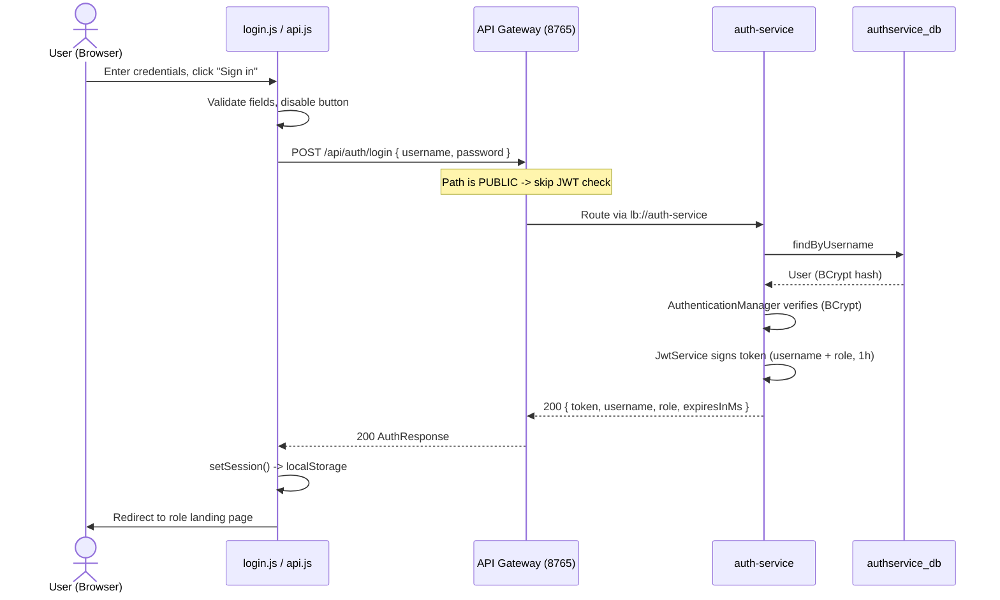
```mermaid
sequenceDiagram
    actor U as User (Browser)
    participant FE as login.js / api.js
    participant GW as API Gateway (8765)
    participant AUTH as auth-service
    participant DB as authservice_db

    U->>FE: Enter credentials, click "Sign in"
    FE->>FE: Validate fields, disable button
    FE->>GW: POST /api/auth/login { username, password }
    Note over GW: Path is PUBLIC -> skip JWT check
    GW->>AUTH: Route via lb://auth-service
    AUTH->>DB: findByUsername
    DB-->>AUTH: User (BCrypt hash)
    AUTH->>AUTH: AuthenticationManager verifies (BCrypt)
    AUTH->>AUTH: JwtService signs token (username + role, 1h)
    AUTH-->>GW: 200 { token, username, role, expiresInMs }
    GW-->>FE: 200 AuthResponse
    FE->>FE: setSession() -> localStorage
    FE->>U: Redirect to role landing page
```

**Next (protected) request:**
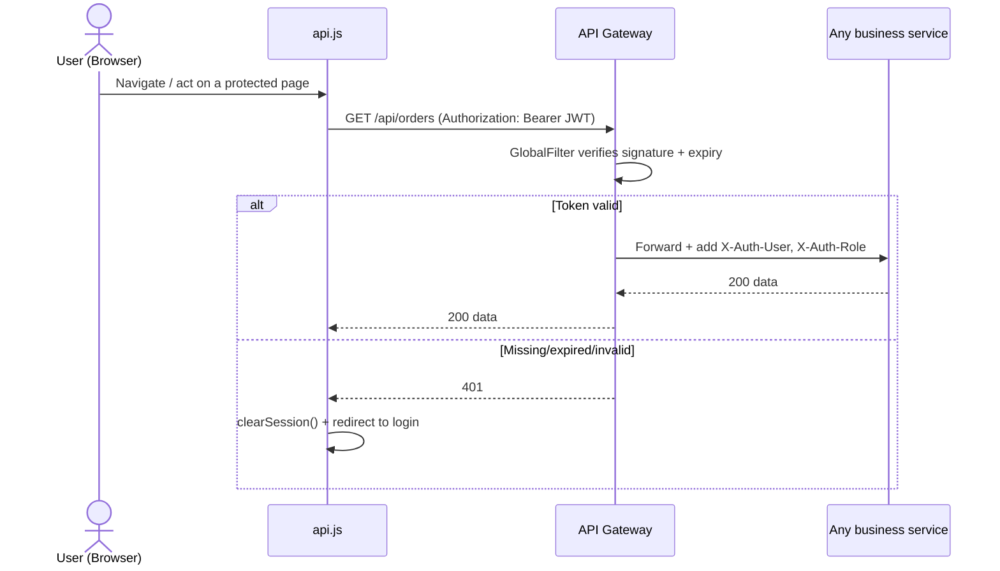
```mermaid
sequenceDiagram
    actor U as User (Browser)
    participant FE as api.js
    participant GW as API Gateway
    participant SVC as Any business service

    U->>FE: Navigate / act on a protected page
    FE->>GW: GET /api/orders (Authorization: Bearer JWT)
    GW->>GW: GlobalFilter verifies signature + expiry
    alt Token valid
        GW->>SVC: Forward + add X-Auth-User, X-Auth-Role
        SVC-->>GW: 200 data
        GW-->>FE: 200 data
    else Missing/expired/invalid
        GW-->>FE: 401
        FE->>FE: clearSession() + redirect to login
    end
```

### 12.2 Flow: Place Order
1. Store Manager fills place‑order form (customer, channel, items, optional coupon), submits →
   `OrderAPI.place(body)` → `POST /api/orders` (with JWT).
2. Gateway validates token, routes to order‑service.
3. `OrderService.placeOrder()` (`@Transactional`): validate → **Feign loyalty** (customer exists)
   → loop **Feign catalog** (product active + price, line totals) → sum → optional **Feign
   promotions** coupon (best‑effort) → `processPayment` → save order + items (status PLACED).
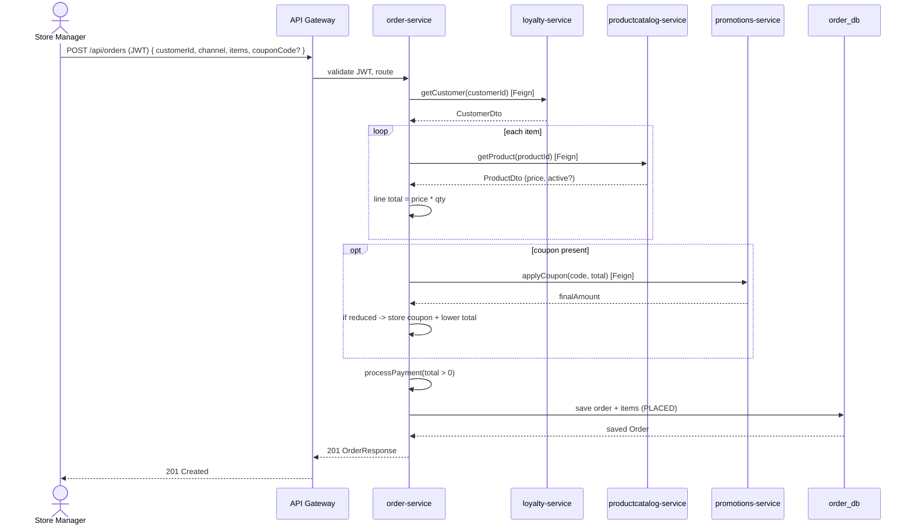
```mermaid
sequenceDiagram
    actor SM as Store Manager
    participant GW as API Gateway
    participant OS as order-service
    participant LOY as loyalty-service
    participant PC as productcatalog-service
    participant PR as promotions-service
    participant DB as order_db

    SM->>GW: POST /api/orders (JWT) { customerId, channel, items, couponCode? }
    GW->>OS: validate JWT, route
    OS->>LOY: getCustomer(customerId)  [Feign]
    LOY-->>OS: CustomerDto
    loop each item
        OS->>PC: getProduct(productId)  [Feign]
        PC-->>OS: ProductDto (price, active?)
        OS->>OS: line total = price * qty
    end
    opt coupon present
        OS->>PR: applyCoupon(code, total)  [Feign]
        PR-->>OS: finalAmount
        OS->>OS: if reduced -> store coupon + lower total
    end
    OS->>OS: processPayment(total > 0)
    OS->>DB: save order + items (PLACED)
    DB-->>OS: saved Order
    OS-->>GW: 201 OrderResponse
    GW-->>SM: 201 Created
```

### 12.3 Flow: Update Order Status (+ loyalty accrual)
1. `OrderAPI.updateStatus(id, status)` → `PATCH /api/orders/{id}/status { newStatus }`.
2. order‑service loads the order, checks `isValidTransition`, saves the new status.
3. If new status is **DELIVERED**, **Feign → loyalty** `/{id}/accrue?amount=` to add points.
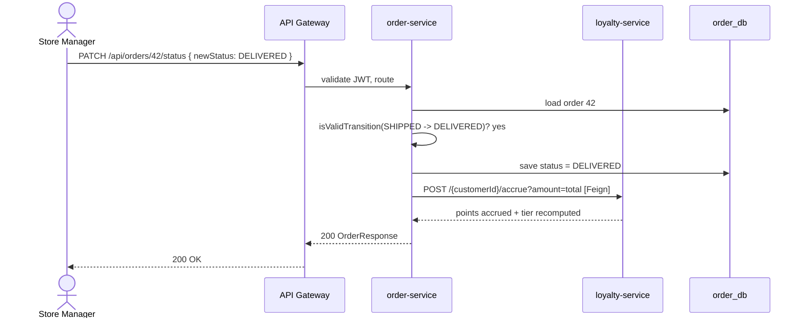
```mermaid
sequenceDiagram
    actor SM as Store Manager
    participant GW as API Gateway
    participant OS as order-service
    participant LOY as loyalty-service
    participant DB as order_db

    SM->>GW: PATCH /api/orders/42/status { newStatus: DELIVERED }
    GW->>OS: validate JWT, route
    OS->>DB: load order 42
    OS->>OS: isValidTransition(SHIPPED -> DELIVERED)? yes
    OS->>DB: save status = DELIVERED
    OS->>LOY: POST /{customerId}/accrue?amount=total [Feign]
    LOY-->>OS: points accrued + tier recomputed
    OS-->>GW: 200 OrderResponse
    GW-->>SM: 200 OK
```

### 12.4 Flow: Admin Creates a User
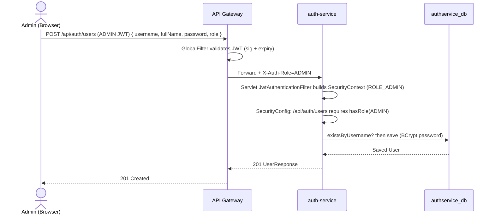
```mermaid
sequenceDiagram
    actor A as Admin (Browser)
    participant GW as API Gateway
    participant AUTH as auth-service
    participant DB as authservice_db

    A->>GW: POST /api/auth/users (ADMIN JWT) { username, fullName, password, role }
    GW->>GW: GlobalFilter validates JWT (sig + expiry)
    GW->>AUTH: Forward + X-Auth-Role=ADMIN
    AUTH->>AUTH: Servlet JwtAuthenticationFilter builds SecurityContext (ROLE_ADMIN)
    AUTH->>AUTH: SecurityConfig: /api/auth/users requires hasRole(ADMIN)
    AUTH->>DB: existsByUsername? then save (BCrypt password)
    DB-->>AUTH: Saved User
    AUTH-->>GW: 201 UserResponse
    GW-->>A: 201 Created
```
⚠️ If a non‑admin (valid token) calls this, the gateway lets it through (token is valid), but
auth‑service's `hasRole("ADMIN")` returns **403 Forbidden**.

### 12.5 Flow: Apply Coupon
Happens **inside Place Order** (order‑service → promotions `/apply`). Standalone, Marketing can
also call `PromotionAPI.apply(code, amount)` → `POST /api/promotions/apply?code=&amount=`.
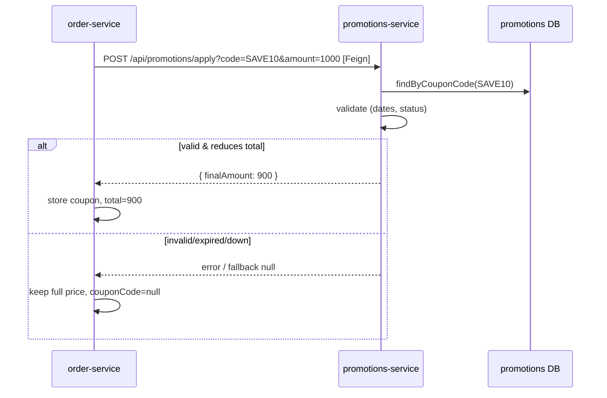
```mermaid
sequenceDiagram
    participant OS as order-service
    participant PR as promotions-service
    participant DB as promotions DB

    OS->>PR: POST /api/promotions/apply?code=SAVE10&amount=1000 [Feign]
    PR->>DB: findByCouponCode(SAVE10)
    PR->>PR: validate (dates, status)
    alt valid & reduces total
        PR-->>OS: { finalAmount: 900 }
        OS->>OS: store coupon, total=900
    else invalid/expired/down
        PR-->>OS: error / fallback null
        OS->>OS: keep full price, couponCode=null
    end
```

### 12.6 Flow: Initiate Return
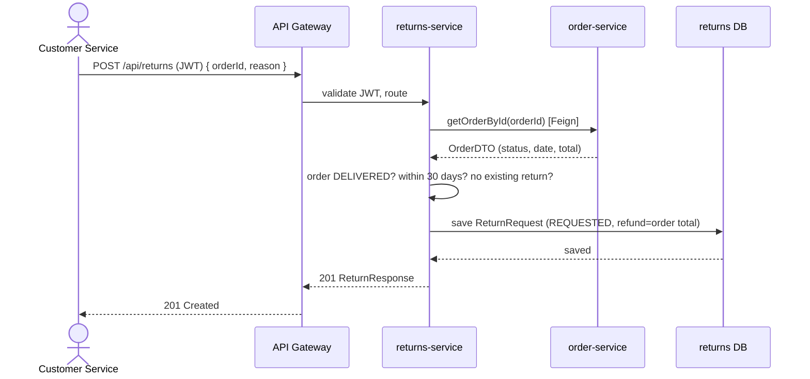
```mermaid
sequenceDiagram
    actor CSA as Customer Service
    participant GW as API Gateway
    participant RS as returns-service
    participant OS as order-service
    participant DB as returns DB

    CSA->>GW: POST /api/returns (JWT) { orderId, reason }
    GW->>RS: validate JWT, route
    RS->>OS: getOrderById(orderId) [Feign]
    OS-->>RS: OrderDTO (status, date, total)
    RS->>RS: order DELIVERED? within 30 days? no existing return?
    RS->>DB: save ReturnRequest (REQUESTED, refund=order total)
    DB-->>RS: saved
    RS-->>GW: 201 ReturnResponse
    GW-->>CSA: 201 Created
```

---

## 13. Resilience: Circuit Breakers & Fallbacks
- order‑service enables Resilience4j for Feign: `spring.cloud.openfeign.circuitbreaker.enabled=true`.
- Each Feign client has a **fallback** (`ProductClientFallback`, `CustomerClientFallback`,
  `PromotionClientFallback`) that returns safe defaults (empty list / null) when the downstream
  is failing.
- Tuning (in `order-service.properties`): `sliding-window-size=10`, `failure-rate-threshold=50` —
  if ≥5 of the last 10 calls fail, the breaker **opens** and calls go straight to the fallback for
  a while, giving the dependency time to recover.
- **Why it matters:** a non‑critical dependency being down **degrades a feature gracefully**
  instead of taking down checkout (e.g., promotions down → order at full price).

**States:** CLOSED (normal) → OPEN (failing, use fallback) → HALF‑OPEN (trial calls) → back to
CLOSED if they succeed.

> **🟥 What if removed?** A slow/dead downstream could make order‑service threads hang and cascade
> failures upward. The breaker isolates faults.

---

## 14. Transactions & Data Consistency
- `placeOrder`, `updateOrderStatus`, `cancelOrder` are **`@Transactional`** → the order + its items
  save **atomically** in `order_db` (all‑or‑nothing). Same pattern in loyalty/returns/product
  services for their writes.
- **Cross‑service consistency is pragmatic**, not distributed‑transactional:
  - **Validate‑then‑save**: order‑service validates customer/products via Feign *before* saving.
  - **Best‑effort coupon**: coupon application is outside strict consistency — if it fails, the
    order still completes.
  - **Eventual side‑effects**: loyalty points accrue *after* delivery via a separate Feign call;
    if that call fails, the order is still delivered (points just aren't added in that moment).
- **No cross‑service foreign keys**: `customerId`/`productId` in `order_db` are **references**, not
  FKs — each service owns its own DB (*Database‑per‑Service*). Joins happen at runtime via Feign.

> **Interview soundbite:** "Within a service I use ACID transactions. Across services I avoid
> distributed transactions and use validate‑then‑save plus best‑effort/eventual updates, accepting
> pragmatic consistency for loose coupling."

---

## 15. Spring Security Filter Chain
A request entering a Spring‑Security‑enabled service (here, **auth‑service**) passes through an
ordered chain of servlet filters. Simplified:

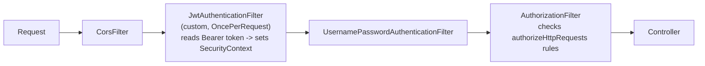
```mermaid
flowchart LR
    A[Request] --> B[CorsFilter]
    B --> C["JwtAuthenticationFilter\n(custom, OncePerRequest)\nreads Bearer token -> sets SecurityContext"]
    C --> D[UsernamePasswordAuthenticationFilter]
    D --> E["AuthorizationFilter\nchecks authorizeHttpRequests rules"]
    E --> F[Controller]
```
- Our custom `JwtAuthenticationFilter` is registered **before**
  `UsernamePasswordAuthenticationFilter` (`addFilterBefore`). It populates the `SecurityContext`
  with `ROLE_<role>` from the token.
- The authorization rules (`permitAll`, `hasRole("ADMIN")`, `authenticated()`) are evaluated at the
  end of the chain. `STATELESS` means no `HttpSession` is created/used.
- `csrf().disable()` is safe here because the API is token‑based and stateless (no cookie‑based
  sessions to forge).

> **🟥 What if removed (the chain/`SecurityConfig`)?** auth‑service couldn't enforce ADMIN‑only user
> management, and login wouldn't be wired to `AuthenticationManager`/BCrypt.

---

## 16. Spring Cloud Gateway / WebFlux (reactive) explained
- The gateway is **reactive (Spring WebFlux + Netty)**, not servlet/Tomcat. It handles requests
  with **non‑blocking** I/O using `Mono`/`Flux`, so a few threads serve many concurrent requests —
  ideal for an I/O‑bound proxy.
- **Routing**: `Path=/api/orders/**` predicate → `uri=lb://order-service`. `lb://` triggers
  client‑side load balancing via Eureka.
- **`GlobalFilter`**: runs for **every** route. Ours returns `Mono<Void>`, can **mutate** the
  exchange/request (to add `X-Auth-*` headers) or short‑circuit with a 401. `getOrder()=-1` makes
  it run early.
- **Why reactive here?** A gateway mostly waits on network I/O; non‑blocking lets it scale with few
  threads. (Contrast: the business services are blocking Spring MVC, which is fine for their CRUD.)

⚠️ **Gotcha:** because the gateway is WebFlux, you can't use servlet filters (`OncePerRequestFilter`)
here — you use `GlobalFilter`/`WebFilter`. That's the technical reason the two JWT filters are
different *types* (§9).

> **🟥 What if removed?** Lose central routing + edge auth + CORS handling (see §6.3).

---

## 17. Use Case Diagrams

### 17.1 System‑wide (actors & use cases)
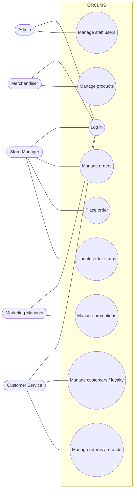
```mermaid
flowchart LR
    Admin([Admin])
    Merch([Merchandiser])
    SM([Store Manager])
    CSA([Customer Service])
    Mkt([Marketing Manager])

    subgraph System["ORCLMS"]
        UC_Login(("Log in"))
        UC_Users(("Manage staff users"))
        UC_Prod(("Manage products"))
        UC_Order(("Manage orders"))
        UC_Place(("Place order"))
        UC_Status(("Update order status"))
        UC_Cust(("Manage customers / loyalty"))
        UC_Promo(("Manage promotions"))
        UC_Return(("Manage returns / refunds"))
    end

    Admin --- UC_Login
    Merch --- UC_Login
    SM --- UC_Login
    CSA --- UC_Login
    Mkt --- UC_Login
    Admin --- UC_Users
    Merch --- UC_Prod
    SM --- UC_Order
    SM --- UC_Place
    SM --- UC_Status
    CSA --- UC_Cust
    CSA --- UC_Return
    Mkt --- UC_Promo
```
> Roles reflect frontend **landing pages**. The hard backend rule: **only ADMIN** manages users;
> everything else just needs a valid login.

### 17.2 auth-service
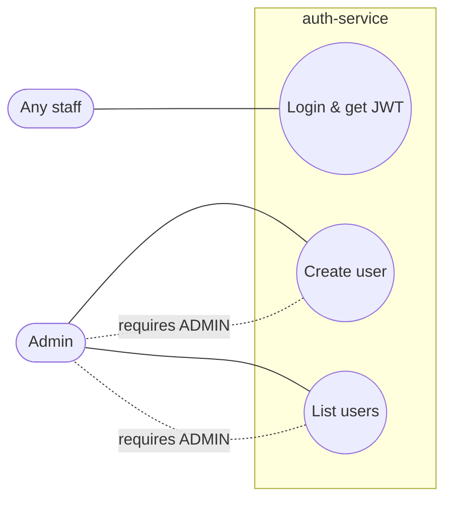
```mermaid
flowchart LR
    User([Any staff])
    Admin([Admin])
    subgraph AuthService["auth-service"]
        L(("Login & get JWT"))
        C(("Create user"))
        List(("List users"))
    end
    User --- L
    Admin --- C
    Admin --- List
    C -. "requires ADMIN" .- Admin
    List -. "requires ADMIN" .- Admin
```

### 17.3 order-service
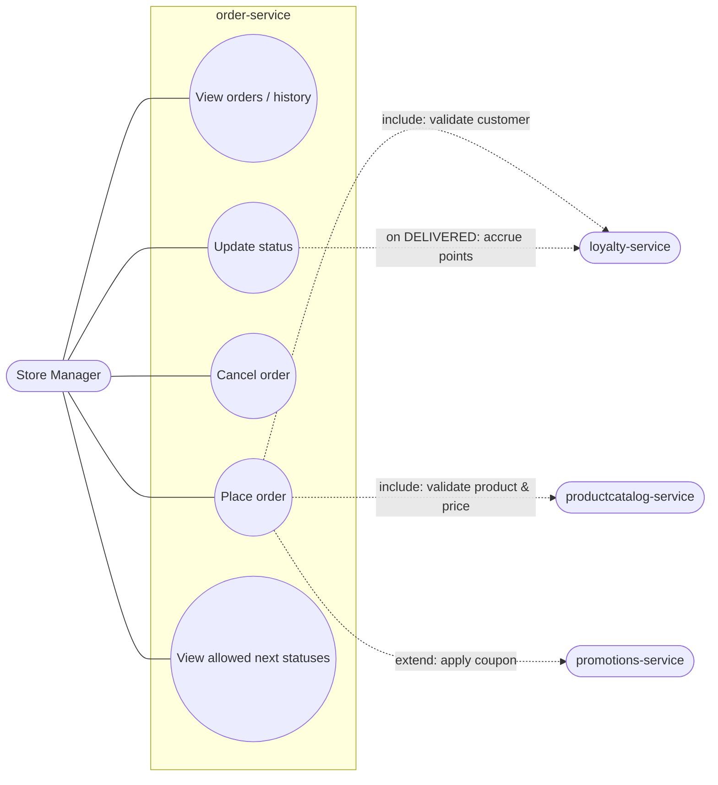
```mermaid
flowchart LR
    SM([Store Manager])
    subgraph OrderService["order-service"]
        V(("View orders / history"))
        P(("Place order"))
        Cancel(("Cancel order"))
        Status(("Update status"))
        Allowed(("View allowed next statuses"))
    end
    SM --- V
    SM --- P
    SM --- Cancel
    SM --- Status
    SM --- Allowed
    P -. "include: validate customer" .-> Loyalty([loyalty-service])
    P -. "include: validate product & price" .-> Catalog([productcatalog-service])
    P -. "extend: apply coupon" .-> Promo([promotions-service])
    Status -. "on DELIVERED: accrue points" .-> Loyalty
```

### 17.4 api-gateway
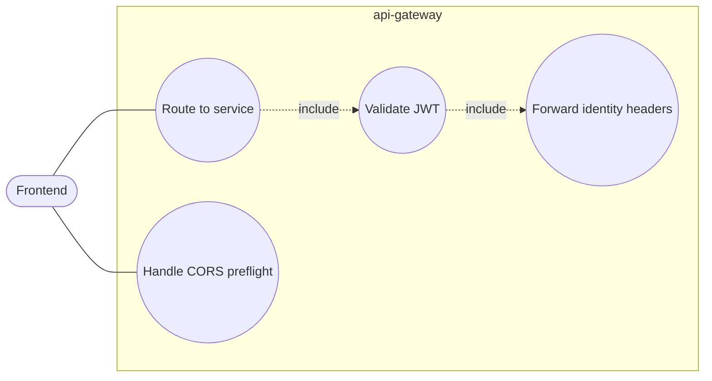
```mermaid
flowchart LR
    Client([Frontend])
    subgraph Gateway["api-gateway"]
        R(("Route to service"))
        J(("Validate JWT"))
        H(("Forward identity headers"))
        CORS(("Handle CORS preflight"))
    end
    Client --- R
    R -. include .-> J
    J -. include .-> H
    Client --- CORS
```

### 17.5 productcatalog-service
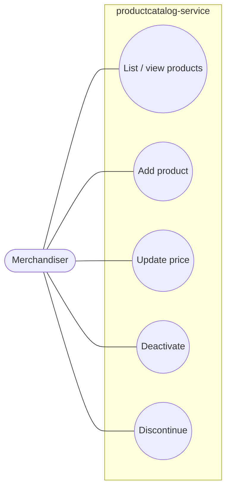
```mermaid
flowchart LR
    Merch([Merchandiser])
    subgraph PC["productcatalog-service"]
        L(("List / view products"))
        A(("Add product"))
        UP(("Update price"))
        D(("Deactivate"))
        DC(("Discontinue"))
    end
    Merch --- L
    Merch --- A
    Merch --- UP
    Merch --- D
    Merch --- DC
```

### 17.6 loyalty-service
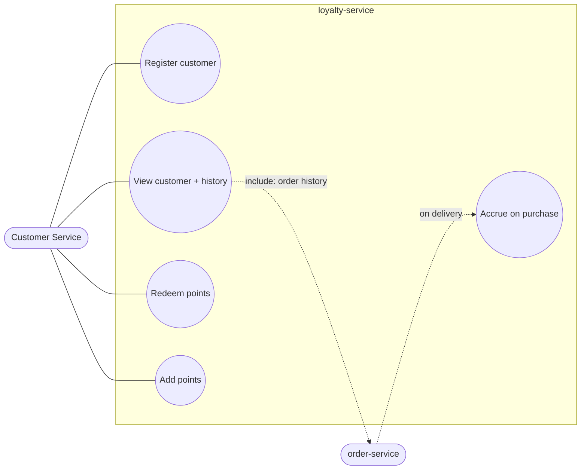
```mermaid
flowchart LR
    CSA([Customer Service])
    OS([order-service])
    subgraph LOY["loyalty-service"]
        Reg(("Register customer"))
        View(("View customer + history"))
        Redeem(("Redeem points"))
        Add(("Add points"))
        Accrue(("Accrue on purchase"))
    end
    CSA --- Reg
    CSA --- View
    CSA --- Redeem
    CSA --- Add
    OS -. "on delivery" .-> Accrue
    View -. "include: order history" .-> OS
```

### 17.7 promotions-service
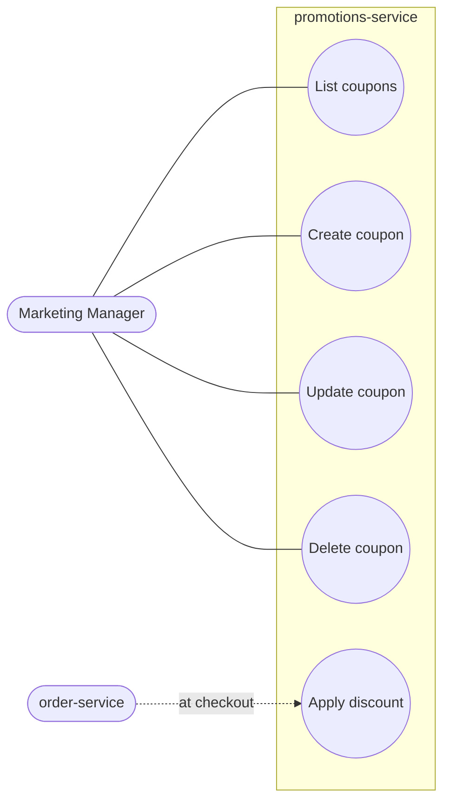
```mermaid
flowchart LR
    Mkt([Marketing Manager])
    OS([order-service])
    subgraph PR["promotions-service"]
        Lst(("List coupons"))
        Cr(("Create coupon"))
        Up(("Update coupon"))
        Del(("Delete coupon"))
        Ap(("Apply discount"))
    end
    Mkt --- Lst
    Mkt --- Cr
    Mkt --- Up
    Mkt --- Del
    OS -. "at checkout" .-> Ap
```

### 17.8 returns-service
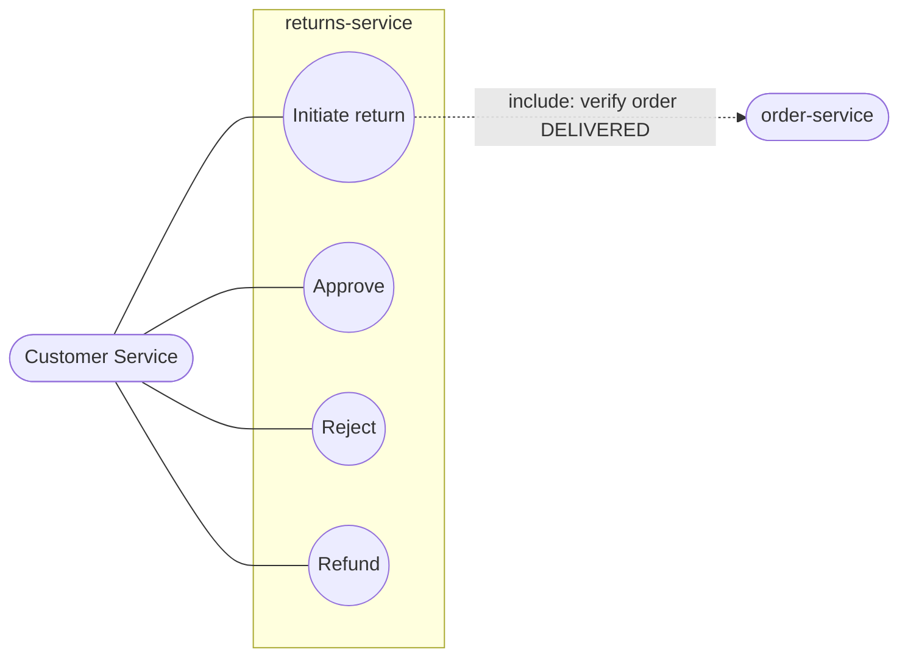
```mermaid
flowchart LR
    CSA([Customer Service])
    OS([order-service])
    subgraph RS["returns-service"]
        Init(("Initiate return"))
        App(("Approve"))
        Rej(("Reject"))
        Ref(("Refund"))
    end
    CSA --- Init
    CSA --- App
    CSA --- Rej
    CSA --- Ref
    Init -. "include: verify order DELIVERED" .-> OS
```

---

## 18. Data Model (per service)

### order-service (`order_db`)
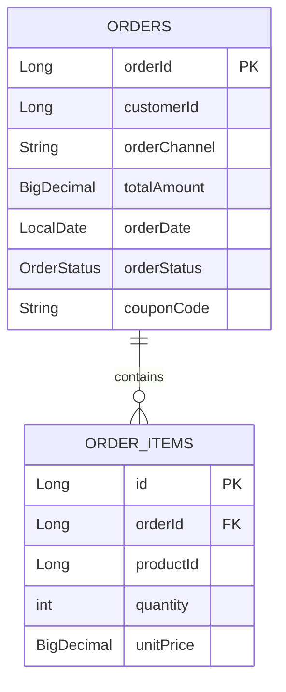
```mermaid
erDiagram
    ORDERS ||--o{ ORDER_ITEMS : contains
    ORDERS {
        Long orderId PK
        Long customerId
        String orderChannel
        BigDecimal totalAmount
        LocalDate orderDate
        OrderStatus orderStatus
        String couponCode
    }
    ORDER_ITEMS {
        Long id PK
        Long orderId FK
        Long productId
        int quantity
        BigDecimal unitPrice
    }
```
> `customerId` / `productId` reference other services' data — **not** FKs (Database‑per‑Service).

### auth-service (`authservice_db`)
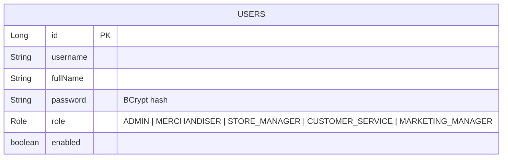
```mermaid
erDiagram
    USERS {
        Long id PK
        String username
        String fullName
        String password "BCrypt hash"
        Role role "ADMIN | MERCHANDISER | STORE_MANAGER | CUSTOMER_SERVICE | MARKETING_MANAGER"
        boolean enabled
    }
```

### productcatalog-service
```mermaid
erDiagram
    PRODUCT {
        Long productId PK
        String skuCode "unique"
        String productName
        String category
        BigDecimal basePrice
        ProductStatus productStatus "ACTIVE | INACTIVE | DISCONTINUED"
    }
```

### loyalty-service
```mermaid
erDiagram
    CUSTOMER {
        Long customerId PK
        String fullName
        String emailId "unique"
        String phoneNumber
        Integer loyaltyPoints
        LoyaltyTier loyaltyTier "SILVER | GOLD | PLATINUM"
    }
```

### promotions-service
```mermaid
erDiagram
    COUPON {
        int couponId PK
        String couponCode
        String discountType "PERCENTAGE | FLAT"
        double discountValue
        LocalDate validFrom
        LocalDate validTo
        CouponStatus couponStatus "ACTIVE | EXPIRED | REDEEMED"
    }
```

### returns-service
```mermaid
erDiagram
    RETURNREQUEST {
        Long returnId PK
        Long orderId
        String returnReason
        BigDecimal refundAmount
        LocalDate requestDate
        ReturnStatus returnStatus "REQUESTED | APPROVED | REJECTED | REFUNDED"
    }
```

---

## 19. "What if we remove X?" — Master Table

| Remove… | Immediate effect | Severity |
|---|---|---|
| **config-server** | Services can't fetch port/DB/JWT config → fail to start or misconfigure | 🔴 Critical (startup) |
| **eureka-server** | `lb://` + Feign name resolution fail → routing & inter‑service calls break | 🔴 Critical |
| **api-gateway** | No single entry, no central auth/CORS; frontend must hit each service | 🔴 Critical |
| **auth-service** | No login/tokens/users → system unreachable | 🔴 Critical |
| **JWT validation** | Anyone can call any endpoint unauthenticated | 🔴 Critical (security) |
| **BCrypt** | Passwords stored in plain text | 🔴 Critical (security) |
| **order-service** | Core retail flow gone; returns & loyalty accrual break | 🔴 Critical |
| **productcatalog-service** | Orders can't validate products/prices → placing orders fails | 🟠 High |
| **loyalty-service** | Orders can't verify customer; no points accrual | 🟠 High |
| **promotions-service** | No coupons — but orders proceed at full price (graceful) | 🟡 Medium |
| **returns-service** | No returns/refunds; ordering unaffected | 🟡 Medium |
| **Resilience4j circuit breakers** | A dead downstream can hang/cascade into callers | 🟠 High |
| **OpenFeign** | Must hand‑write REST calls between services | 🟡 Medium (dev cost) |
| **frontend** | No UI; REST API still usable via Postman | 🟢 Low |

---

## 20. Code‑Specific Gotcha Questions (with answers)

**Q: Why are there TWO JWT filters?**
A: The gateway `GlobalFilter` (reactive) does **edge authentication** for the whole system and
injects `X-Auth-*` headers. auth‑service's servlet `OncePerRequestFilter` rebuilds the
`SecurityContext` so it can enforce **`hasRole("ADMIN")`** on `/api/auth/users`. Different
runtimes (WebFlux vs MVC) force different filter types. (§9)

**Q: The gateway returns 401 but the body is empty — why?**
A: `unauthorized()` sets the status and calls `setComplete()` but ignores the `message`. So
clients get `401` with no body; `api.js` then shows a generic "session expired" message. (§6.3)

**Q: Why aren't `customerId`/`productId` foreign keys in `order_db`?**
A: **Database‑per‑Service** — each service owns its DB; you can't FK across databases. They're
plain references resolved at runtime via Feign. (§14, §18)

**Q: What happens if promotions‑service is down during checkout?**
A: The `PromotionClient` fallback returns null, `applyCouponIfPresent` catches it, and the order
completes at **full price** with `couponCode=null`. Graceful degradation. (§10.1, §13)

**Q: What happens if config‑server is down when a service starts?**
A: The service can't load its externalized config (port, datasource, JWT secret) and fails to
start correctly — that's why config‑server boots first. (§6.1)

**Q: How does order‑service know a product's price?**
A: It calls productcatalog `GET /products/{id}` via Feign and uses `basePrice`; it never trusts a
client‑supplied price, and rejects inactive products / non‑positive prices. (§10.1)

**Q: Can a STORE_MANAGER create users with a valid token?**
A: No. The token is valid so the gateway lets it through, but auth‑service's `hasRole("ADMIN")`
returns **403**. (§12.4)

**Q: Where does the JWT secret come from and why must it match?**
A: From config‑server's shared `application.properties` (`jwt.secret`). auth‑service signs with it
(HS256) and the gateway verifies with the same key — symmetric crypto, so they must be identical.
(§8)

**Q: How are loyalty points calculated on delivery?**
A: On status→DELIVERED, order‑service calls loyalty `POST /{id}/accrue?amount=total`; loyalty adds
`floor(amount)` points and recomputes the tier (SILVER/GOLD/PLATINUM). (§10.3, §12.3)

**Q: Why is the gateway reactive but the business services are not?**
A: A gateway is I/O‑bound (proxying), so non‑blocking WebFlux scales with few threads; the CRUD
services are simpler with blocking Spring MVC. (§16)

**Q: How do you enforce the order status flow?**
A: `isValidTransition` allows only PLACED→CONFIRMED/CANCELLED, CONFIRMED→SHIPPED/CANCELLED,
SHIPPED→DELIVERED. `getAllowedNextStatuses` drives the UI dropdown so users can't pick invalid
transitions. (§10.1)

**Q: Why `@Autowired(required=false)` on promotions' Feign clients?**
A: Those cross‑service clients are optional; promotions degrades gracefully (returns defaults /
`eligible=true`) if they aren't available, instead of failing to start. (§10.4)

---

## 21. How to Run the Whole System
Start in this order (each service fetches config from config‑server and registers with Eureka):
1. **config-server** (8888)
2. **eureka-server** (8761)
3. **api-gateway** (8765)
4. Business services: **auth-service** (8095), **order-service** (8081),
   **productcatalog-service**, **loyalty-service**, **promotions-service**, **returns-service**

```powershell
cd <service-name>
.\mvnw spring-boot:run
```
Then open the **frontend** `login.html` and sign in with the seeded admin (`admin` / `admin123`).

> Prerequisites: **MySQL** running locally (DBs auto‑create via
> `?createDatabaseIfNotExist=true`), and env vars `DB_USERNAME` / `DB_PASSWORD` set.

---

## 22. Glossary
| Term | Meaning |
|---|---|
| **JWT** | Signed, self‑contained token carrying identity/claims (`header.payload.signature`). |
| **Claim** | A field inside a JWT (e.g. `role`, `sub`, `exp`). |
| **HS256** | HMAC‑SHA256: symmetric signing — same secret signs & verifies. |
| **BCrypt** | Slow, salted password‑hashing algorithm. |
| **Feign** | Declarative HTTP client — write an interface, Spring makes the call. |
| **Eureka** | Netflix service registry for discovery. |
| **`lb://`** | "Load‑balanced" URI — resolve a service name via the registry. |
| **Circuit Breaker** | Stops calling a failing dependency; uses a fallback. |
| **GlobalFilter** | A Spring Cloud Gateway filter that runs for every request. |
| **OncePerRequestFilter** | A servlet filter guaranteed to run once per request (MVC). |
| **Stateless auth** | No server session; the token carries identity. |
| **Database‑per‑Service** | Each microservice owns its own database. |
| **WebFlux** | Spring's reactive, non‑blocking web stack (used by the gateway). |

---

*Pair this with `CHEAT_SHEET.md` for the night‑before revision, and open the named classes
(`JwtAuthenticationGatewayFilter.java`, `AuthService.java`, `JwtService.java`, `OrderService.java`)
so you can point to exact lines while explaining.*

