# Omnichannel Retail Management System (ORCLMS) — Complete Project Guide

> A single, interview-ready reference that explains **what the project is**, **how every
> piece fits together**, and **exactly what happens behind the scenes** (with a deep dive on
> `auth-service`, `api-gateway`, `config-server`, and `order-service`).
>
> Use the table of contents to jump around. Diagrams are written in **Mermaid** — they render
> automatically on GitHub, in VS Code (with a Mermaid extension), and in IntelliJ's Markdown
> preview.

---

## Table of Contents
1. [Elevator Pitch (say this in the interview)](#1-elevator-pitch)
2. [The Big Picture — Architecture](#2-the-big-picture--architecture)
3. [Technology Stack](#3-technology-stack)
4. [The Services, One by One](#4-the-services-one-by-one)
5. [Core Spring Cloud Concepts (explained simply)](#5-core-spring-cloud-concepts-explained-simply)
6. [Deep Dive: "What happens when a user clicks Login?"](#6-deep-dive-what-happens-when-a-user-clicks-login)
7. [Deep Dive: "What happens when a user places an order?"](#7-deep-dive-what-happens-when-a-user-places-an-order)
8. [Security Model (JWT end-to-end)](#8-security-model-jwt-end-to-end)
9. [Use Case Diagrams (all actions, per role)](#9-use-case-diagrams)
10. [Sequence Diagrams (key flows)](#10-sequence-diagrams)
11. [Data Model](#11-data-model)
12. [Resilience: Circuit Breakers & Fallbacks](#12-resilience-circuit-breakers--fallbacks)
13. [How to Run the Whole System](#13-how-to-run-the-whole-system)
14. [Likely Interview Questions & Crisp Answers](#14-likely-interview-questions--crisp-answers)
15. [Glossary](#15-glossary)

---

## 1. Elevator Pitch

> "ORCLMS is a **microservices-based retail platform** built with **Spring Boot** and
> **Spring Cloud**. It lets retail staff manage products, orders, returns, promotions, and
> customer loyalty across multiple sales channels (web, store, etc.). The system is split into
> **independent services** that each own their data and talk to each other over REST. A
> **Spring Cloud Config Server** centralizes configuration, **Eureka** handles service
> discovery, and an **API Gateway** is the single secured entry point that validates **JWT
> tokens** issued by a dedicated **auth-service**. The frontend is a lightweight vanilla
> JavaScript app that only ever talks to the gateway."

**The one-line role-based summary:** different staff roles (Admin, Store Manager,
Merchandiser, Customer Service, Marketing) log in once, receive a JWT, and the gateway uses
that token to authorize every subsequent request to the right microservice.

---

## 2. The Big Picture — Architecture

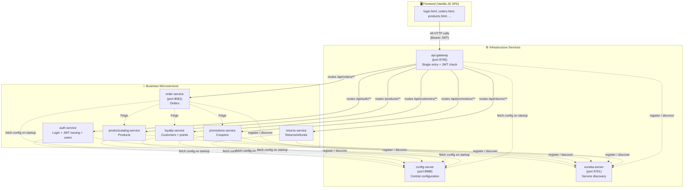

**Reading the diagram:**
- The **frontend never calls a microservice directly** — every request goes through the **API Gateway** at `http://localhost:8765`.
- **Solid arrows** = synchronous HTTP routing through the gateway.
- **Dotted arrows** = internal service-to-service calls (`order-service` uses **OpenFeign** clients) and infrastructure wiring (Eureka registration, Config fetch).

---

## 3. Technology Stack

| Layer | Technology | Why it's used |
|---|---|---|
| Language / Runtime | **Java + Spring Boot** | Rapid microservice development |
| Service discovery | **Spring Cloud Netflix Eureka** | Services find each other by name, not hard-coded IPs |
| Central config | **Spring Cloud Config Server** | One place for all `.properties`; no secrets in each repo |
| API Gateway | **Spring Cloud Gateway (WebFlux / reactive)** | Single entry point, routing, central JWT check, CORS |
| Inter-service calls | **OpenFeign** | Declarative REST clients (`order-service` → others) |
| Resilience | **Resilience4j Circuit Breaker** | Fallbacks when a downstream service is down |
| Security | **Spring Security + JWT (jjwt)** | Stateless auth; password hashing with BCrypt |
| Persistence | **Spring Data JPA + MySQL** | Each service owns its own DB (`order_db`, etc.) |
| Frontend | **Vanilla HTML/CSS/JS (ES modules)** | Lightweight; talks only to the gateway |

---

## 4. The Services, One by One

### 🟦 config-server (Infrastructure)
- A Spring Cloud **Config Server**. On startup, every other service asks it: *"give me my
  configuration."*
- The actual config files live in the **`orclms-config-server-main/`** folder (one
  `.properties` per service + a shared `application.properties`).
- `application.properties` holds **shared settings** for everyone: the Eureka URL, JPA
  settings, and the **shared JWT secret + expiration**.
- **Interview point:** "It externalizes configuration so we can change settings without
  rebuilding services, and it keeps the JWT secret in exactly one place so both `auth-service`
  (which *signs* tokens) and `api-gateway` (which *verifies* them) agree."

### 🟦 eureka-server (Infrastructure)
- The **service registry**. Each service registers itself by name (e.g. `order-service`,
  `loyalty-service`) and discovers others by name.
- This is why the gateway can route to `lb://order-service` and Feign can call
  `@FeignClient(name = "loyalty-service")` — no IP addresses anywhere.
- **`lb://`** means *load-balanced* — if there were multiple instances, requests would be
  spread across them.

### 🟦 api-gateway (Infrastructure + Security)
- **The single front door.** Runs on **port 8765**. The frontend's `CONFIG.BASE_URL` points here.
- **Two jobs:**
  1. **Routing** — maps URL paths to services (defined in `api-gateway.properties`):

     | Path predicate | Routed to |
     |---|---|
     | `/api/auth/**` | auth-service |
     | `/api/orders/**` | order-service |
     | `/products/**` | productcatalog-service |
     | `/api/customers/**` | loyalty-service |
     | `/api/promotions/**` | promotions-service |
     | `/api/returns/**` | returns-service |

  2. **Central JWT validation** — a `GlobalFilter`
     (`JwtAuthenticationGatewayFilter`) checks the `Authorization: Bearer <token>` header on
     **every** request *except* public ones (`/api/auth/login`, `/actuator`, `/eureka`, and
     CORS `OPTIONS` pre-flight). If the token is valid, it **decodes the username + role** and
     forwards them downstream as `X-Auth-User` and `X-Auth-Role` headers, so individual
     services can *trust* the gateway.
- **Interview point:** "Authentication is centralized at the edge. Downstream services don't
  each have to re-validate the token; they can read the identity from the trusted gateway
  headers."

### 🟦 auth-service (Security)
- Owns **users, login, and JWT issuing**.
- **Endpoints** (`/api/auth`):
  - `POST /api/auth/login` — **public**, the only way into the system. Returns a JWT.
  - `POST /api/auth/users` — **ADMIN-only**, provisions new staff accounts.
  - `GET /api/auth/users` — **ADMIN-only**, lists accounts.
- **No self-registration** — only an ADMIN can create accounts. A default ADMIN
  (`admin` / `admin123`) is seeded on first startup by `DataInitializer`.
- Passwords are stored **BCrypt-hashed**. Login uses Spring Security's `AuthenticationManager`
  to verify credentials, then `JwtService` signs a token containing the **username (subject)**
  and **role (claim)**, valid for **1 hour** (`jwt.expiration=3600000` ms).
- **Roles** (the `Role` enum): `ADMIN`, `MERCHANDISER`, `STORE_MANAGER`, `CUSTOMER_SERVICE`,
  `MARKETING_MANAGER`.

### 🟩 order-service (Core Business) — port 8081
- Manages the **order lifecycle**. Has its own MySQL DB `order_db`.
- **Endpoints** (`/api/orders`):
  - `GET /api/orders` — all orders, or `?customerId=` for one customer's history.
  - `GET /api/orders/{id}` — one order.
  - `GET /api/orders/products` — product list (proxied from product catalog).
  - `POST /api/orders` — **place an order**.
  - `POST /api/orders/{id}/cancel` — cancel.
  - `PATCH /api/orders/{id}/status` — change status.
  - `GET /api/orders/{id}/allowed-statuses` — valid next statuses (drives the UI dropdown).
- **Talks to 3 other services via Feign:**
  - `productcatalog-service` → validate products, get prices & names.
  - `loyalty-service` → verify the customer exists; **award loyalty points on delivery**.
  - `promotions-service` → **apply a coupon** at checkout.
- **Order status state machine** (`OrderStatus`):

  ```mermaid
  stateDiagram-v2
      [*] --> PLACED
      PLACED --> CONFIRMED
      PLACED --> CANCELLED
      CONFIRMED --> SHIPPED
      CONFIRMED --> CANCELLED
      SHIPPED --> DELIVERED
      DELIVERED --> [*]
      CANCELLED --> [*]
  ```
  Transitions are enforced in `isValidTransition(...)` — you cannot skip steps or go backward.
  When an order reaches **DELIVERED**, the service calls loyalty-service to **accrue points**.

### 🟩 productcatalog-service
- Manages products: list, get, create, update price, deactivate. Used by Merchandisers.

### 🟩 loyalty-service
- Manages **customers** and **loyalty points**: register, get, redeem points, accrue points.
  Used by Customer Service staff and called by order-service on delivery.

### 🟩 promotions-service
- Manages **coupons**: list, create, and `apply` (compute discounted amount). Called by
  order-service at checkout and by Marketing staff in the UI.

### 🟩 returns-service
- Manages **returns/refunds**: create a return, approve, reject, refund.

### 🟨 frontend
- Plain HTML/JS organized by module (`order-management/`, `productcatalog/`, `loyalty/`,
  `promotion/`, `returns/`, `admin/`).
- **Key shared JS files** (`assets/js/`):
  - `config.js` — holds `BASE_URL` (the gateway).
  - `api.js` — the single `fetch` wrapper; attaches the JWT, handles 401 by logging out.
  - `endpoints.js` — every backend URL named once (so paths live in one place).
  - `auth.js` — stores the token/role in `localStorage`, decides the landing page per role,
    guards protected pages.

---

## 5. Core Spring Cloud Concepts (explained simply)

| Concept | One-sentence explanation | Where it lives here |
|---|---|---|
| **Service Discovery** | Services register & find each other by name instead of IP. | Eureka server + `@EnableEurekaClient`-style clients |
| **Centralized Config** | All config in one server, fetched at startup. | config-server + `orclms-config-server-main/` |
| **API Gateway** | One secured entry point that routes to services. | api-gateway + `api-gateway.properties` |
| **Client-side Load Balancing** | `lb://service-name` picks an instance from Eureka. | gateway routes & Feign |
| **Declarative REST client** | An interface annotated with `@FeignClient` becomes an HTTP client. | order-service `client/` package |
| **Circuit Breaker** | If a downstream call keeps failing, "trip" and use a fallback. | Resilience4j + `*Fallback` classes |
| **Stateless JWT auth** | No server session; identity travels inside a signed token. | auth-service issues, gateway verifies |

---

## 6. Deep Dive: "What happens when a user clicks Login?"

This is the flow the interviewer will most likely ask you to whiteboard.

### Step-by-step (in plain English)
1. **User types username + password** on `login.html` and clicks **Sign in**.
2. **`login.js`** (the page script) prevents the default form submit, validates that both
   fields are filled, disables the button, and calls `AuthAPI.login({ username, password })`.
3. **`endpoints.js`** maps that to `POST /api/auth/login`, and **`api.js`** sends the request
   to the **API Gateway** (`http://localhost:8765/api/auth/login`). No token yet — login is public.
4. **API Gateway** sees the path `/api/auth/login` is in its **PUBLIC_PATHS** list, so the JWT
   filter **skips validation** and routes the request to **auth-service** (via `lb://auth-service`).
5. **auth-service `AuthController.login()`** receives it and calls `AuthService.login()`:
   - It asks Spring Security's **`AuthenticationManager`** to verify the credentials. Internally
     `CustomUserDetailsService` loads the user from the DB and **BCrypt** checks the password.
   - On success, it loads the `User`, then **`JwtService.generateToken()`** builds a signed JWT
     containing the **username** (subject) and **role** (claim), signed with the **shared secret**.
   - It returns an **`AuthResponse`** = `{ token, username, role, expiresInMs }`.
6. **Back in the browser**, `login.js` calls `setSession()` which stores the token, username and
   role in **`localStorage`**, shows a "Welcome" toast, and **redirects to the role's landing page**
   (`landingFor()`): e.g. ADMIN → `admin/users.html`, STORE_MANAGER → `order-management/orders.html`.
7. From now on, **every** request `api.js` makes automatically attaches
   `Authorization: Bearer <token>`, and the **gateway validates it on each call**.

### Login sequence diagram
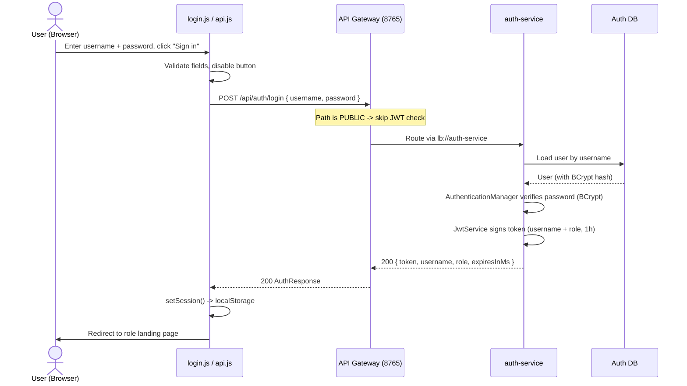

### What happens on the *next* (protected) request
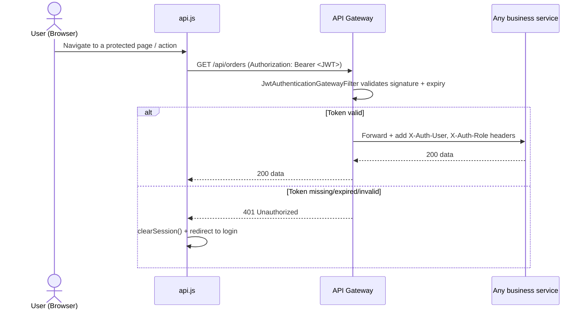

---

## 7. Deep Dive: "What happens when a user places an order?"

This is the best showcase of **inter-service communication + resilience**.

1. A Store Manager fills the **place-order** form (customer, channel, items, optional coupon)
   and submits. `OrderAPI.place(body)` → `POST /api/orders` through the gateway (with JWT).
2. The gateway validates the token and routes to **order-service**.
3. **`OrderService.placeOrder()`** runs inside a **`@Transactional`** method:
   - Validates the request (customer id, channel, at least one item).
   - **Feign → loyalty-service**: confirm the **customer exists**.
   - For each item, **Feign → productcatalog-service**: confirm the product exists, is
     **active**, and has a valid price; compute the **line total**.
   - Sums everything into `totalAmount`, sets status **PLACED**, date = today.
   - If a coupon was provided, **Feign → promotions-service** `apply` — *best effort*: only if
     it genuinely **reduces** the total is the coupon stored and the total lowered. If the
     promotions-service is down or the coupon is invalid/expired, the order proceeds at full price.
   - A simple `processPayment()` check (amount > 0) stands in for a real payment gateway.
   - Saves the order (and its items) to `order_db`.
4. Later, when the order is moved to **DELIVERED** via `PATCH /api/orders/{id}/status`,
   order-service **Feign → loyalty-service** to **accrue loyalty points** based on the amount.

### Place-order sequence diagram
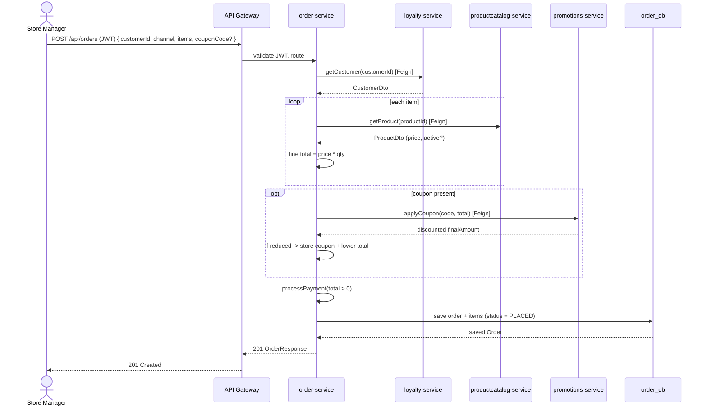

---

## 8. Security Model (JWT end-to-end)

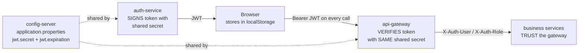

**Key facts to memorize:**
- **Stateless**: no server-side session (`SessionCreationPolicy.STATELESS`). All identity is in
  the token.
- **One shared secret** (HS256) lives in `config-server`'s `application.properties`. auth-service
  uses it to **sign**; api-gateway uses it to **verify**. They must match.
- **Token contents:** subject = username, claim `role`, `issuedAt`, `expiration` (1 hour).
- **Authorization layers:**
  - *Edge (gateway):* is the token valid? (rejects anonymous/expired requests).
  - *Service (auth-service):* `/api/auth/users` is `hasRole("ADMIN")` — even a valid non-admin
    token can't manage users.
  - *Frontend (UX only):* `auth.js` hides nav items per role — **not** a security boundary,
    just convenience.
- **Passwords**: BCrypt-hashed, never stored in plain text.

---

## 9. Use Case Diagrams

### 9.1 System-wide actors & use cases
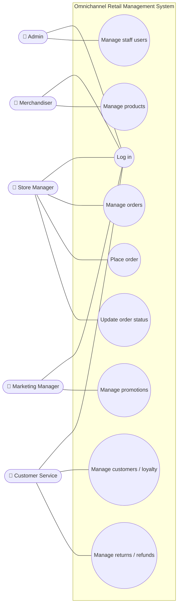
> Note: roles above reflect the **landing pages** each role gets in the frontend. The hard
> security rule enforced in the backend is: **only ADMIN** can manage users; everything else
> requires a valid login.

### 9.2 auth-service use cases
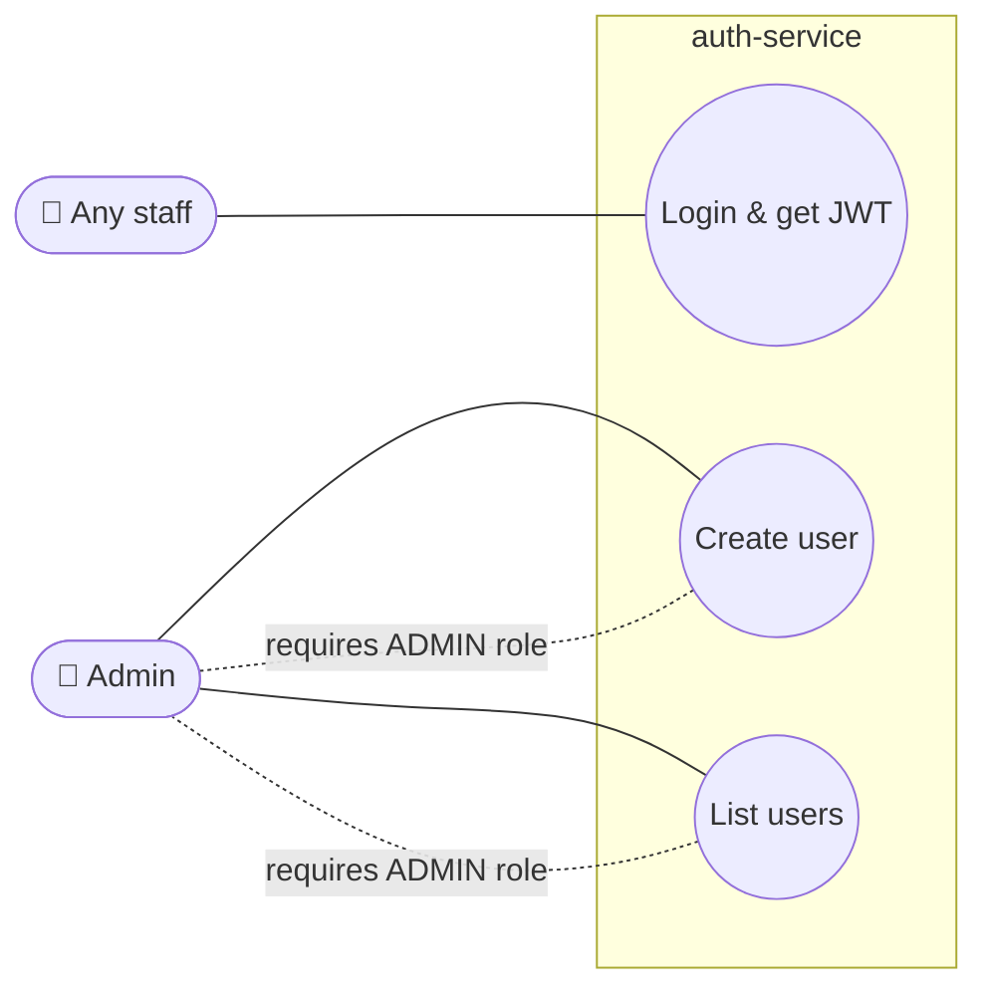

### 9.3 order-service use cases
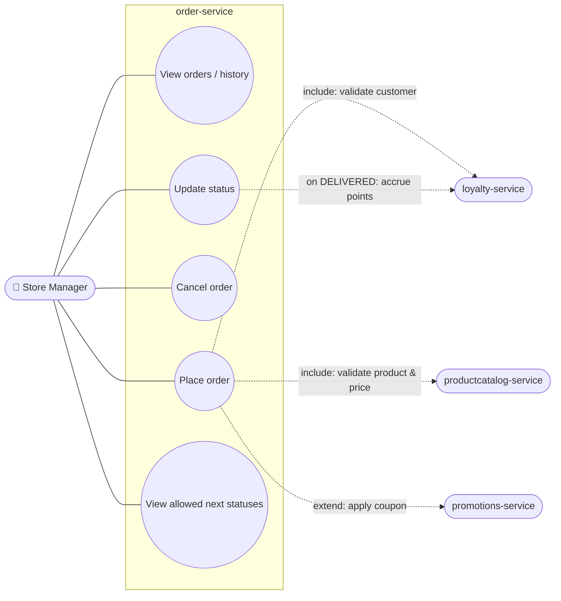

### 9.4 api-gateway use cases
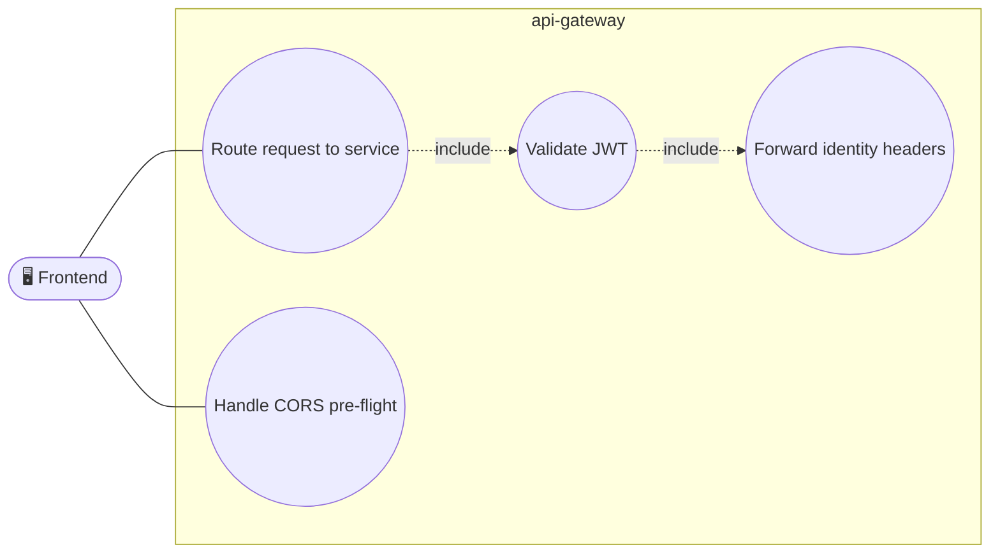

---

## 10. Sequence Diagrams (key flows)

### 10.1 Admin creates a new staff user
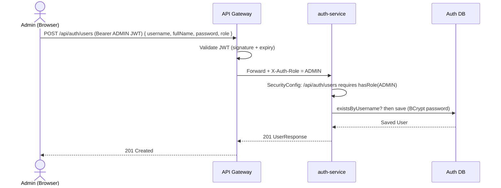

### 10.2 Update order status (with loyalty accrual on delivery)
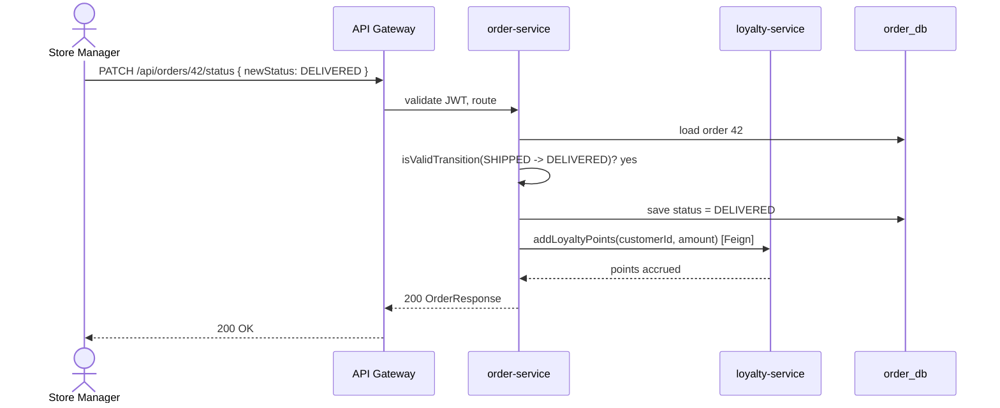

---

## 11. Data Model

### order-service (`order_db`)
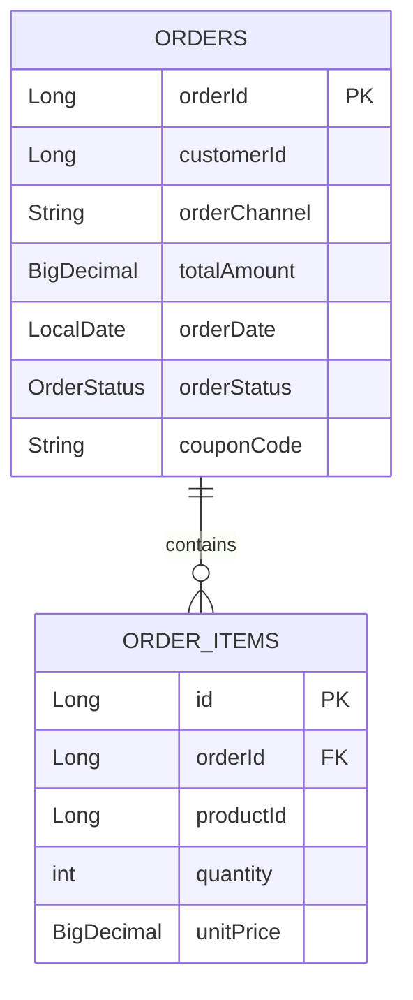
> `customerId` and `productId` are **references to other services' data**, not foreign keys —
> each service owns its own database (the *Database-per-Service* pattern). order-service looks
> those up at runtime via Feign.

### auth-service (users)
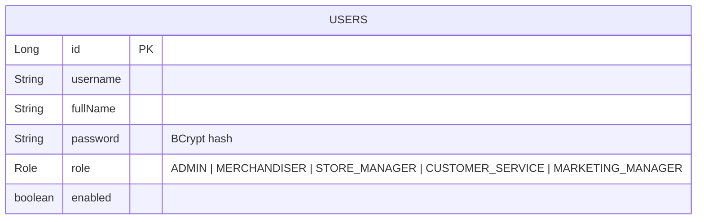

---

## 12. Resilience: Circuit Breakers & Fallbacks

- `order-service` enables Resilience4j circuit breakers for its Feign calls
  (`spring.cloud.openfeign.circuitbreaker.enabled=true`).
- Each Feign client has a **fallback** class (`ProductClientFallback`, `CustomerClientFallback`,
  `PromotionClientFallback`).
- **Why it matters:** if, say, promotions-service is down, the order doesn't crash — the
  fallback returns a safe default (e.g. no coupon applied) and the order completes at full price.
- The config tunes the breaker: `sliding-window-size=10`, `failure-rate-threshold=50%` — i.e.
  if 5 of the last 10 calls fail, the breaker **opens** and calls go straight to the fallback
  for a while, giving the downstream service time to recover.

**Interview soundbite:** "We isolate failures. A non-critical dependency being down degrades a
feature gracefully instead of taking down the whole checkout."

---

## 13. How to Run the Whole System

Start in this order (each service fetches config from config-server and registers with Eureka):

1. **config-server** (8888)
2. **eureka-server** (8761)
3. **api-gateway** (8765)
4. Business services: **auth-service**, **order-service** (8081), **productcatalog-service**,
   **loyalty-service**, **promotions-service**, **returns-service**

```bash
cd <service-name>
./mvnw spring-boot:run     # On Windows PowerShell: .\mvnw spring-boot:run
```

Then open the **frontend** `login.html` and sign in with the seeded admin (`admin` / `admin123`).

> Prerequisites: **MySQL** running locally (services auto-create their DBs, e.g.
> `order_db?createDatabaseIfNotExist=true`), and env vars `DB_USERNAME` / `DB_PASSWORD` set.

---

## 14. Likely Interview Questions & Crisp Answers

**Q: Why microservices instead of a monolith?**
A: Independent deployment, scaling, and ownership per domain (orders, products, loyalty…). A
failure in one service doesn't necessarily bring down others, especially with circuit breakers.

**Q: How do services find each other?**
A: Eureka service discovery. Services register by name; the gateway and Feign clients use
`lb://service-name`/`@FeignClient(name=...)` so there are no hard-coded hosts.

**Q: How is configuration managed?**
A: Spring Cloud Config Server serves per-service `.properties` plus a shared
`application.properties`. Change config in one place; no rebuilds. The JWT secret lives there so
auth-service and the gateway stay in sync.

**Q: Walk me through authentication.**
A: User logs in via auth-service → receives a signed JWT (username + role, 1-hour expiry) →
browser stores it → every request carries `Authorization: Bearer <token>` → the **API Gateway**
validates the signature/expiry centrally and forwards identity headers downstream. Stateless, no
sessions.

**Q: Where is authorization enforced?**
A: Two real layers: the **gateway** rejects anonymous/expired requests; **auth-service**
restricts `/api/auth/users` to `ROLE_ADMIN`. The frontend role-based menus are UX only.

**Q: How does order-service talk to others?**
A: Declarative **OpenFeign** clients to product, loyalty, and promotions services, each with a
**Resilience4j fallback** for graceful degradation.

**Q: What guarantees order data consistency?**
A: `placeOrder` is `@Transactional`, so the order + items are saved atomically in `order_db`.
Cross-service consistency is handled pragmatically (validate-then-save; best-effort coupon).

**Q: How are passwords stored?**
A: BCrypt-hashed via Spring Security's `PasswordEncoder`. Plain text is never persisted.

**Q: What happens when a JWT expires mid-session?**
A: The next call returns 401 at the gateway; the frontend `api.js` catches it, clears the
session, and redirects to login.

**Q: How would you scale this?**
A: Run multiple instances of any service; Eureka + client-side load balancing (`lb://`) spread
the load. The gateway and stateless JWT make horizontal scaling straightforward.

**Q: What's the role of the API Gateway specifically?**
A: Single entry point: routing, **central JWT validation**, CORS handling, and forwarding a
trusted identity to services — so each service doesn't reimplement auth.

---

## 15. Glossary

| Term | Meaning |
|---|---|
| **JWT** | JSON Web Token — a signed, self-contained token carrying user identity/claims. |
| **Claim** | A piece of data inside a JWT (e.g. `role`). |
| **BCrypt** | A slow, salted password-hashing algorithm. |
| **Feign** | Declarative HTTP client — write an interface, Spring makes the REST call. |
| **Eureka** | Netflix service registry for discovery. |
| **`lb://`** | "Load-balanced" URI scheme — resolve a service name via the registry. |
| **Circuit Breaker** | Pattern that stops calling a failing dependency and uses a fallback. |
| **Gateway GlobalFilter** | A filter that runs for every request through the gateway. |
| **Stateless auth** | No server session; the token carries all needed identity. |
| **Database-per-Service** | Each microservice owns its own database. |

---

*Generated as an interview-prep companion. Pair this with the codebase: open the files named in
each section (e.g. `JwtAuthenticationGatewayFilter.java`, `OrderService.java`,
`AuthService.java`) so you can point to the exact lines while explaining.*
